#### 16. Workspace Environment Variables

```sh
echo "Generic Jenkins Variable"
echo "Build Number $BUILD_NUMBER" 
echo "Node Name $NODE_NAME"
echo "Job Name $JOB_NAME"
echo "Executor Number $EXECUTOR_NUMBER"
echo "Workspace $WORKSPACE"
echo "GIT Environment Variables"
echo "GIT Commit $GIT_COMMIT"
echo "GIT Branch $GIT_BRANCH"
echo "GIT Previous Commit $GIT_PREVIOUS_COMMIT"
echo "GIT URL $GIT_URL"
```

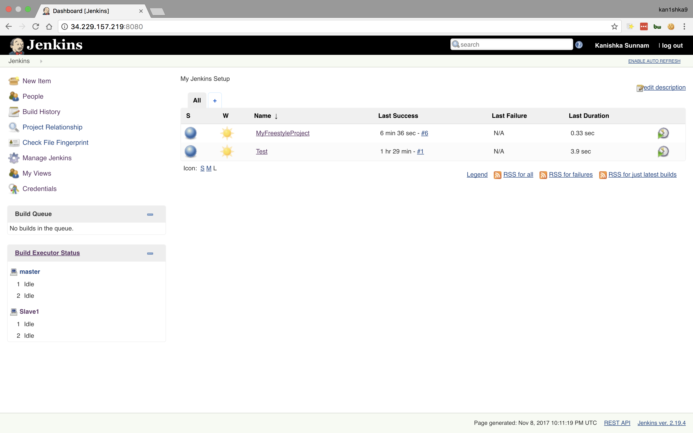

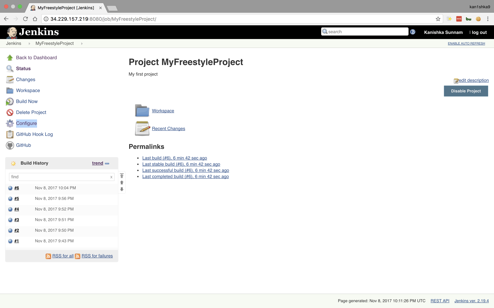

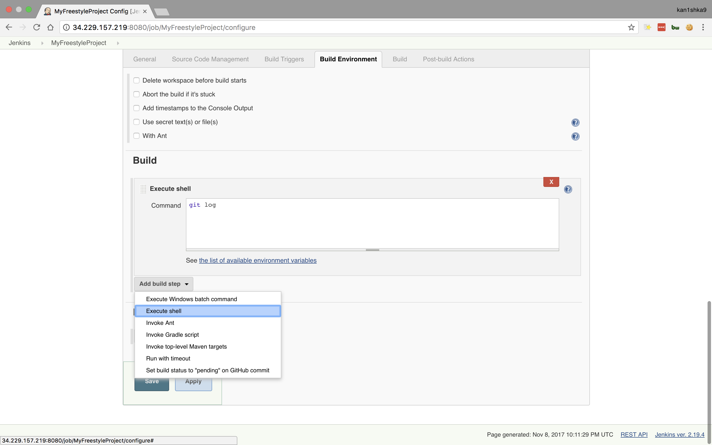

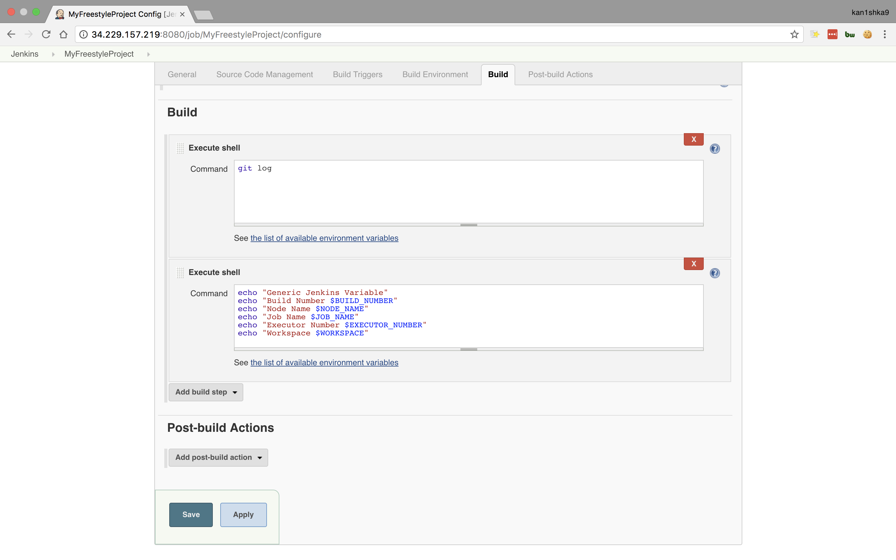

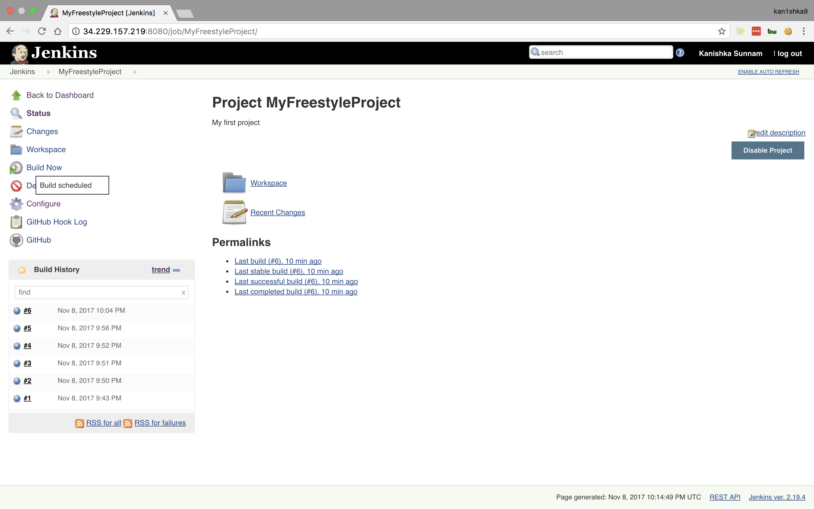

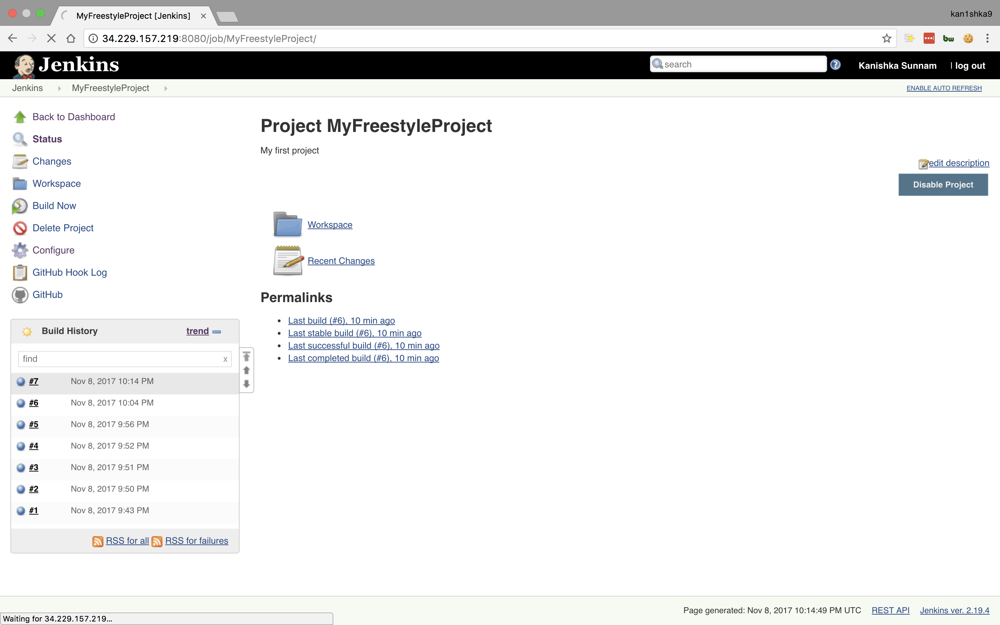

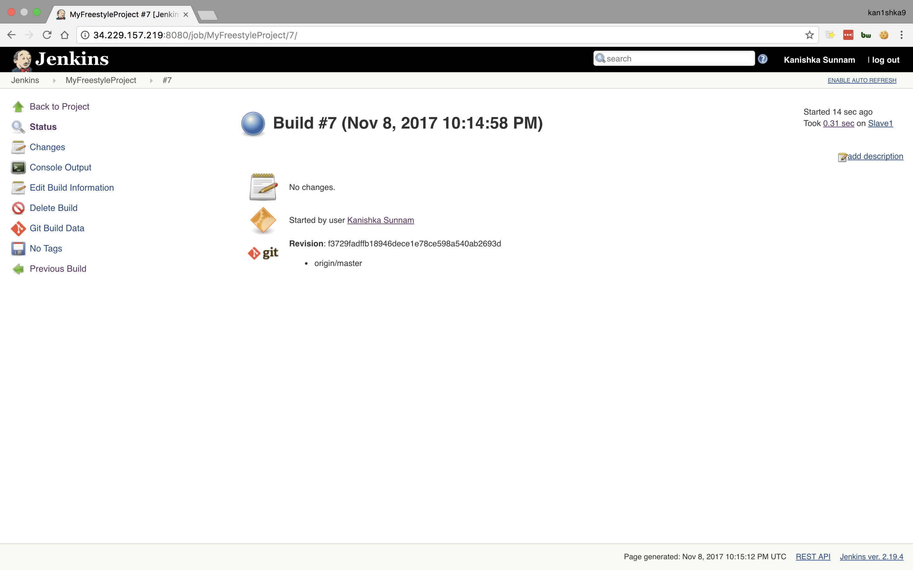

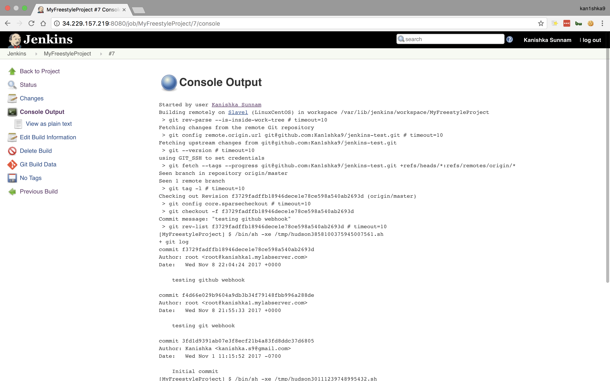

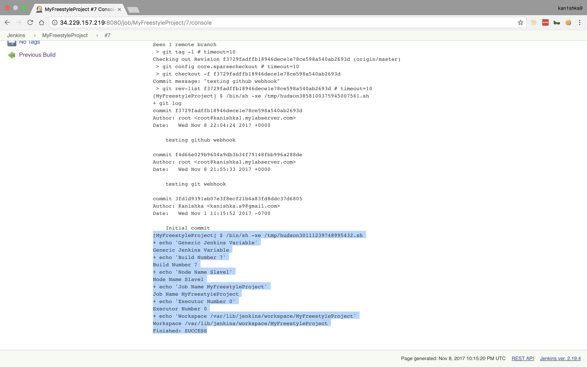

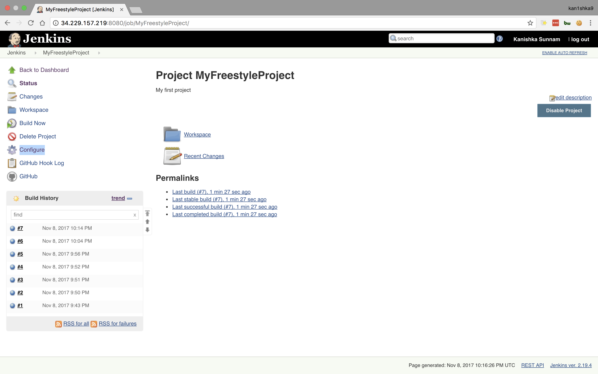

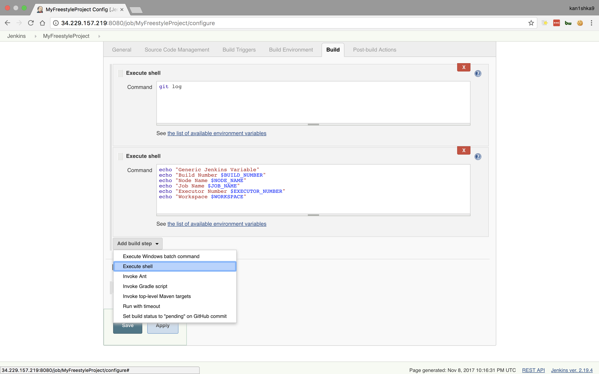

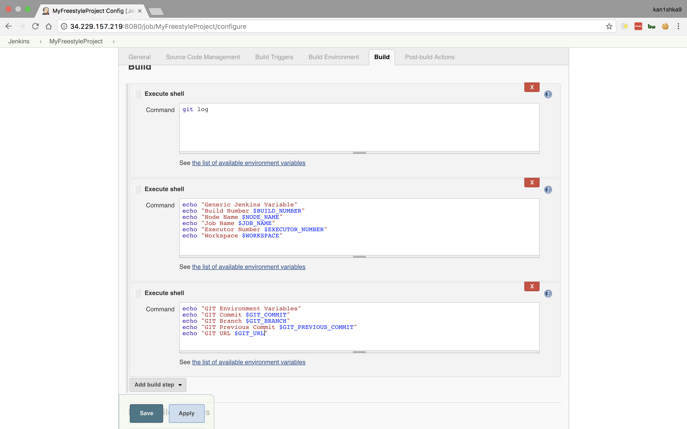

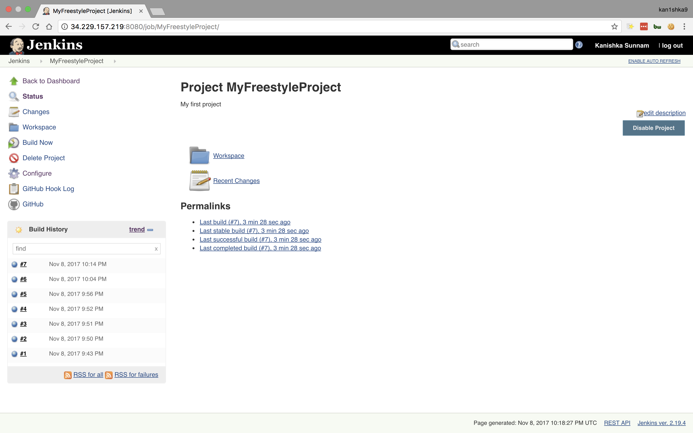

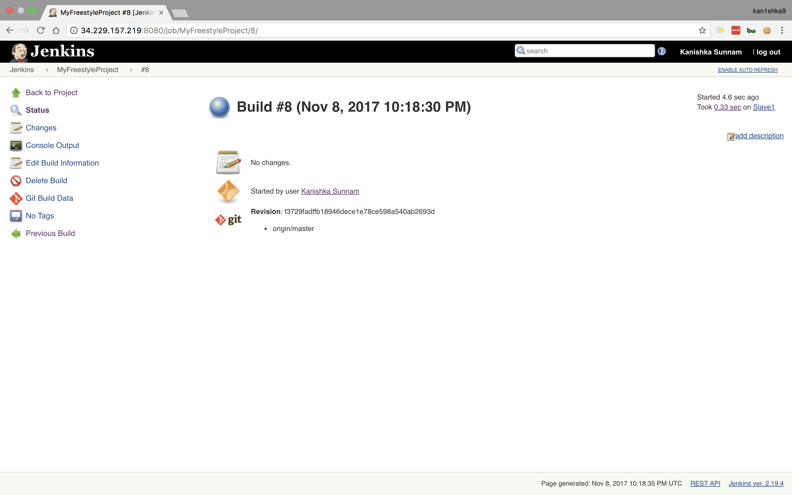

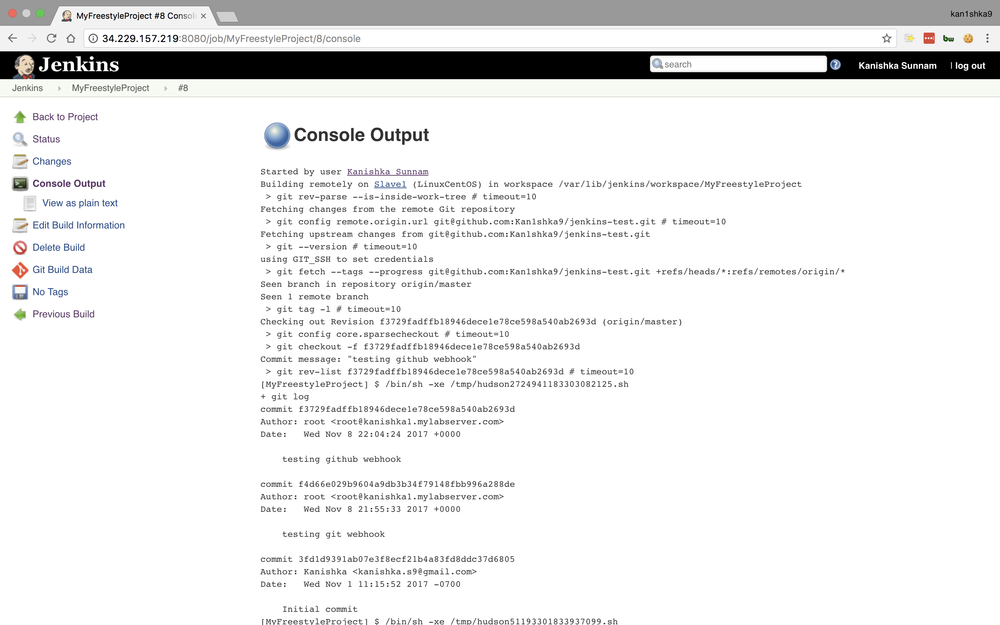

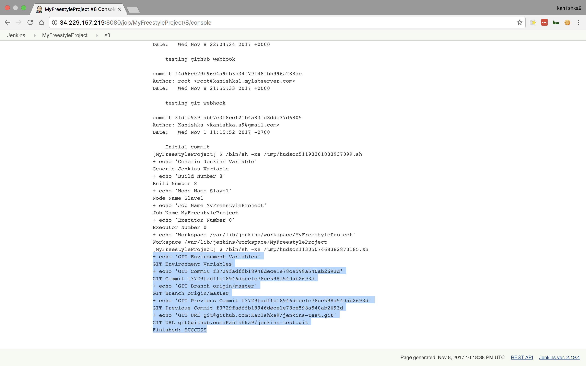