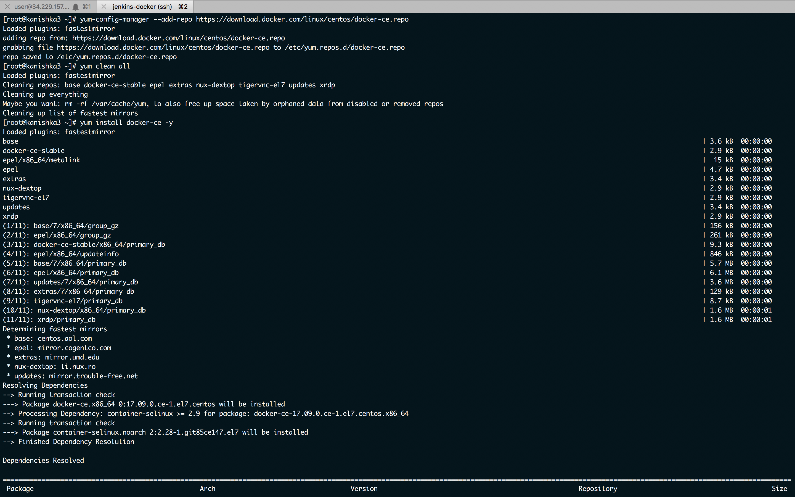
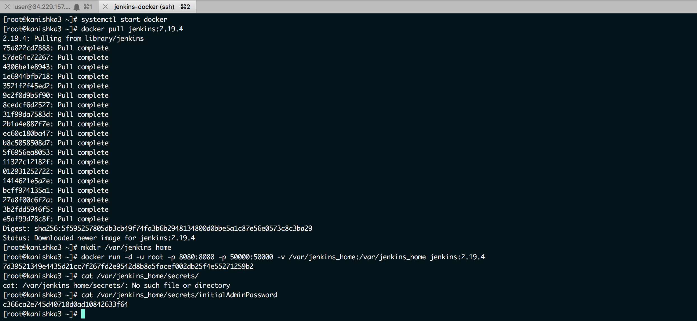
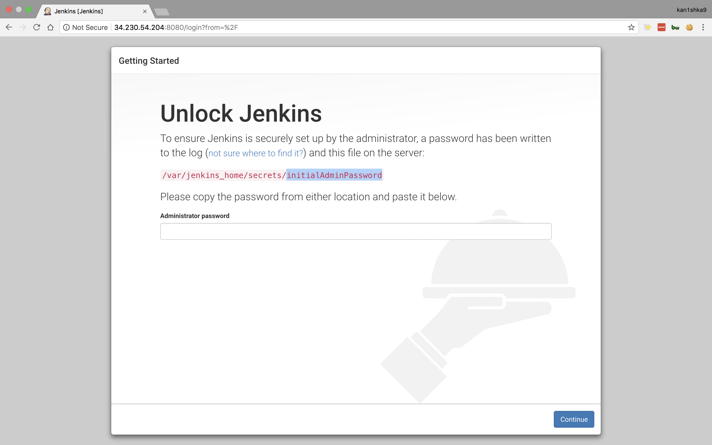
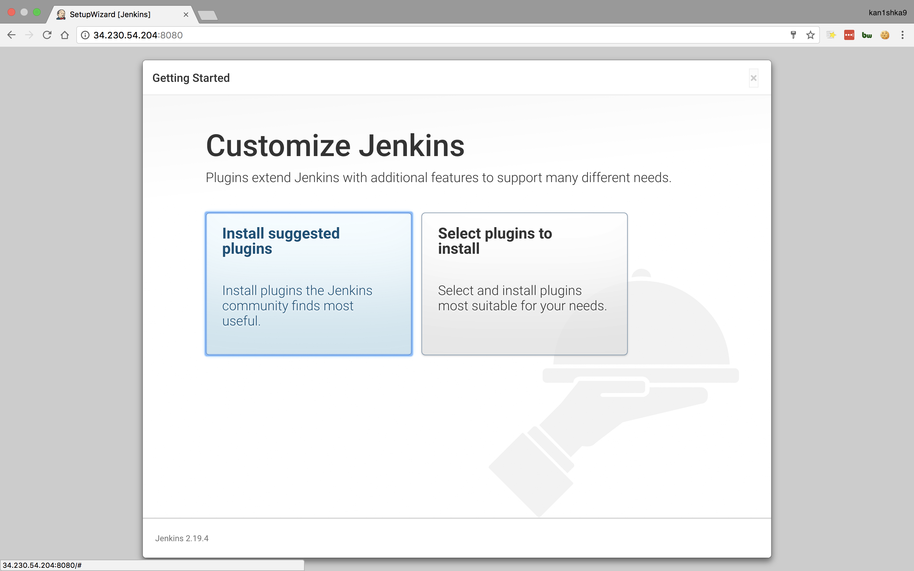
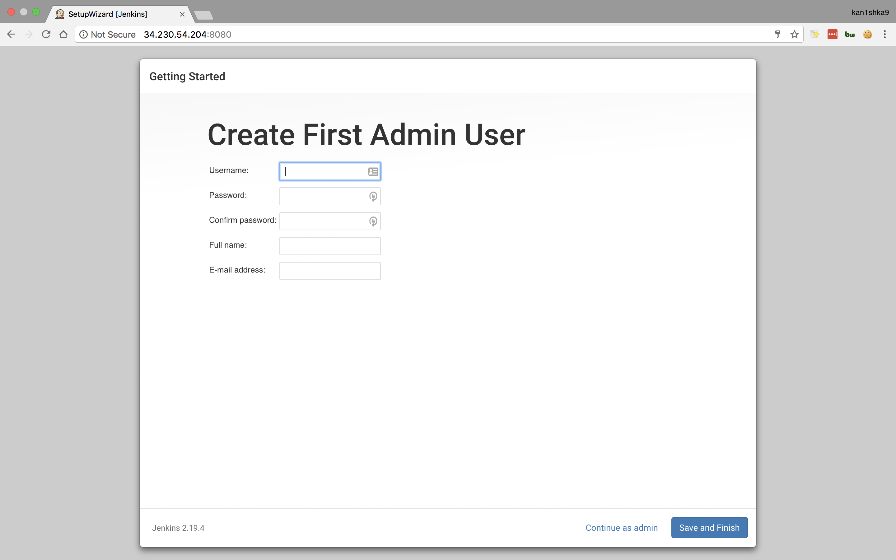
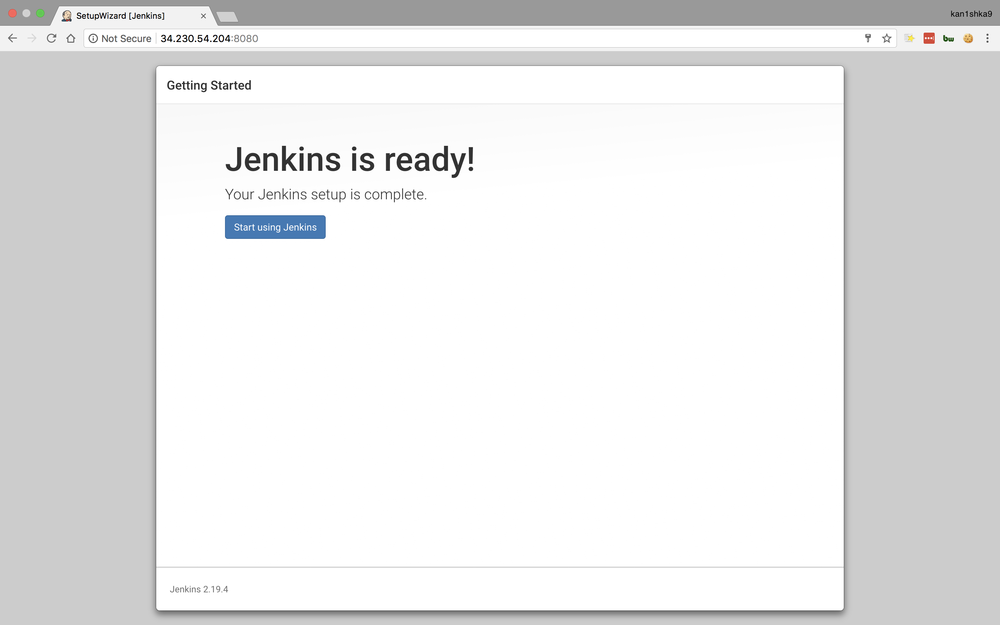
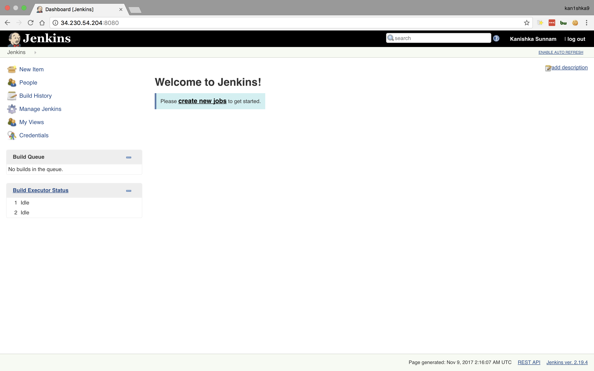
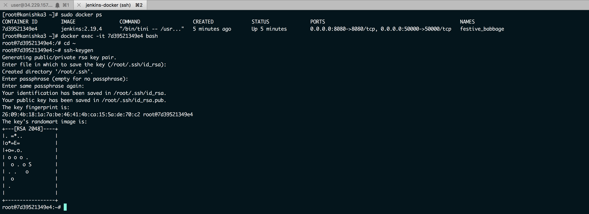

#### 22. Setting Up a Jenkins Master with Docker

```sh
yum-config-manager --add-repo https://download.docker.com/linux/centos/docker-ce.repo
yum clean all
yum install docker-ce -y
systemctl start docker
docker pull jenkins:2.19.4
mkdir /var/jenkins_home
docker run -d -u root -p 8080:8080 -p 50000:50000 -v /var/jenkins_home:/var/jenkins_home jenkins:2.19.4
cat /var/jenkins_home/secrets/initialAdminPassword
```

















```sh
sudo docker ps
docker exec -it 7d39521349e4 bash
cd ~
ssh-keygen
```


