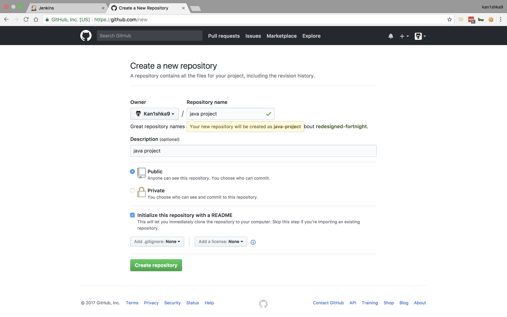
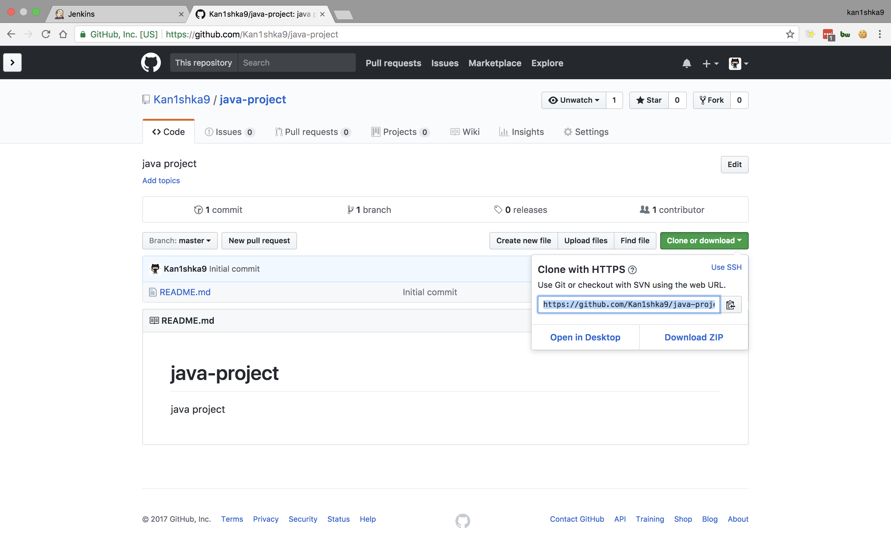
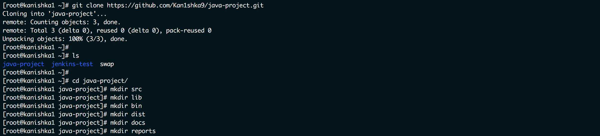
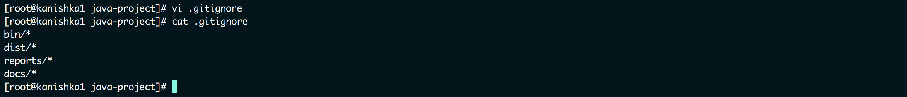
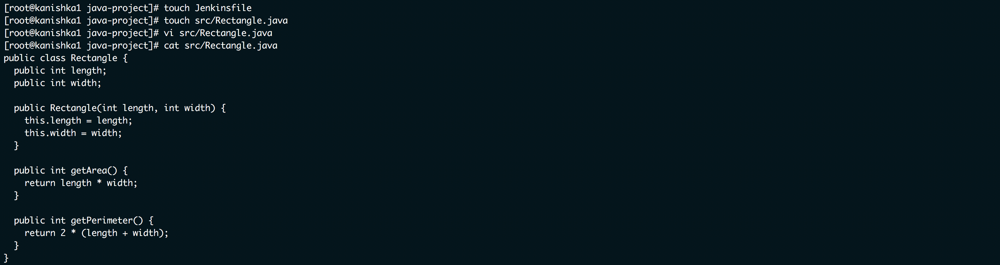
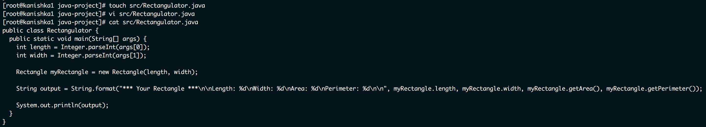
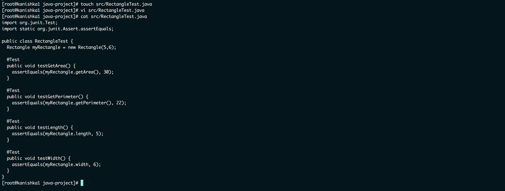
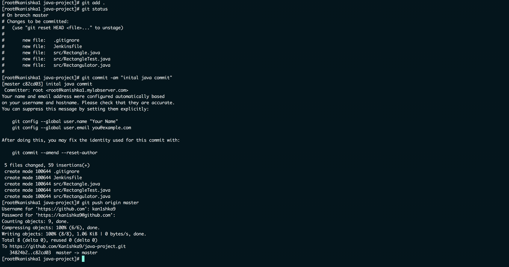
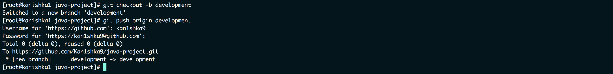

#### 24. Our Java Pipeline Project

[``content-jenkins-java-project``](https://github.com/linuxacademy/content-jenkins-java-project)















```sh
git add .
git status
git commit -am "inital java commit"
git push origin master
git checkout -b development
git push origin development
```





