#### 25. Docker Install

```sh
yum remove docker docker-common container-selinux
```

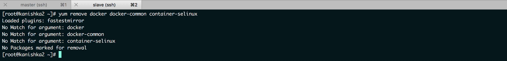

```sh
yum install yum-utils -y
```

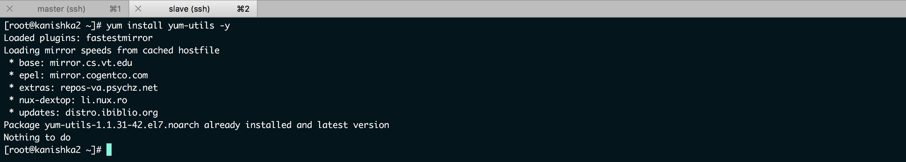

```sh
yum-config-manager --add-repo https://download.docker.com/linux/centos/docker-ce.repo
```

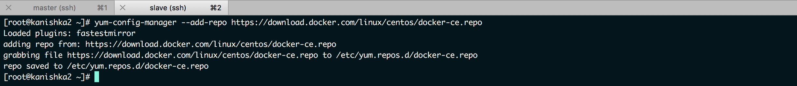

```sh
cat /etc/yum.repos.d/docker-ce.repo
```

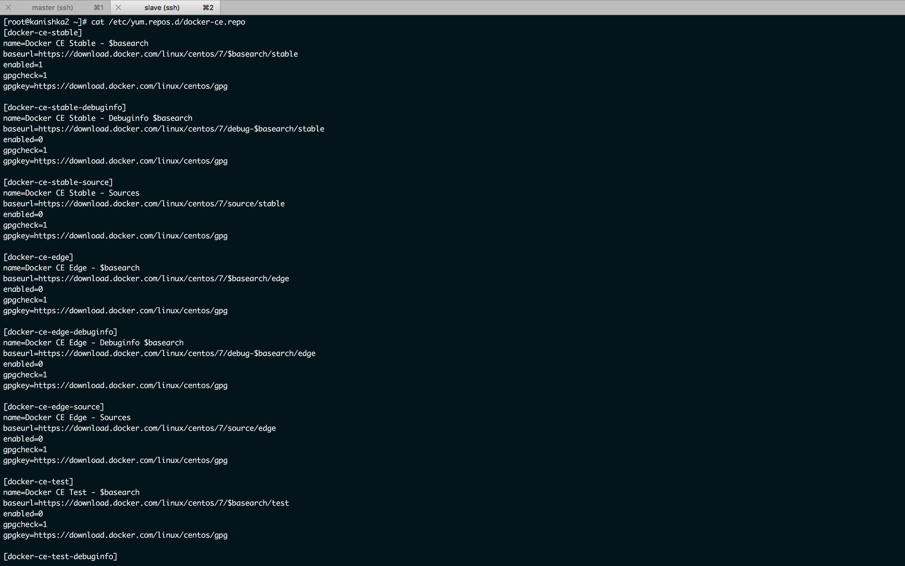

```sh
yum clean all
```

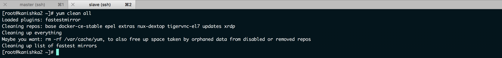

```sh
yum install docker-ce -y
```

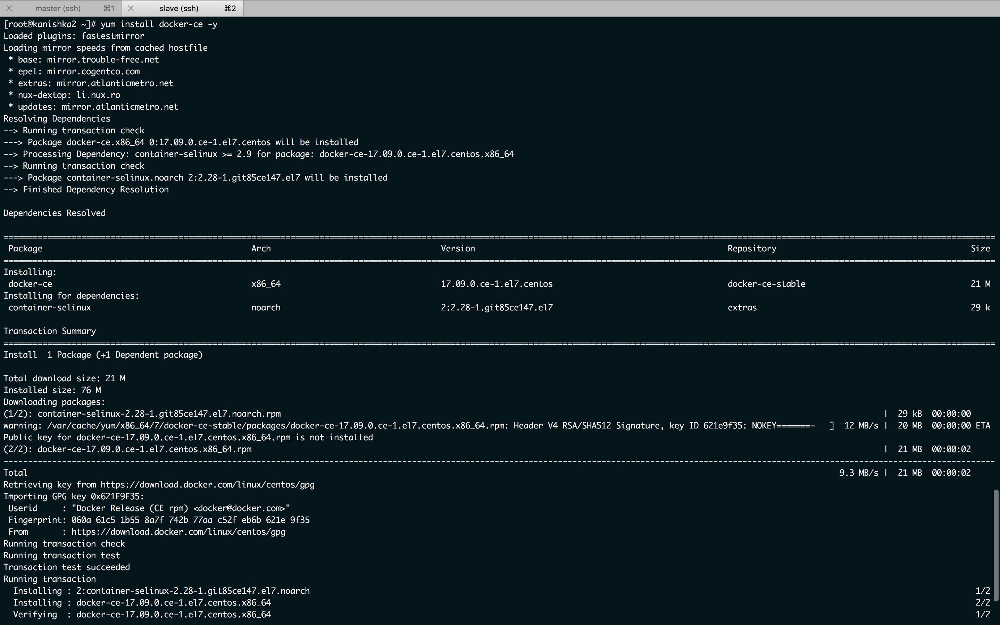

```sh
gpasswd -a jenkins docker
```

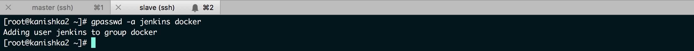

```sh
systemctl start docker
```

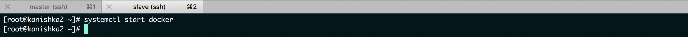

```sh
systemctl restart jenkins
```

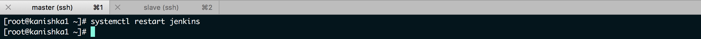

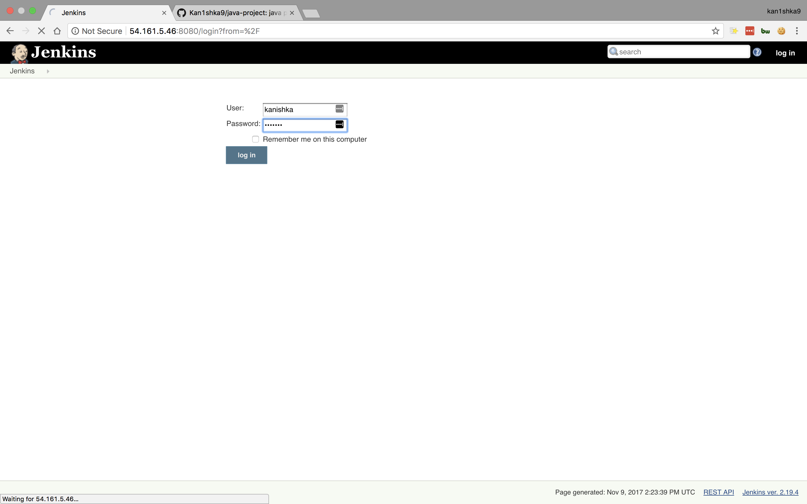


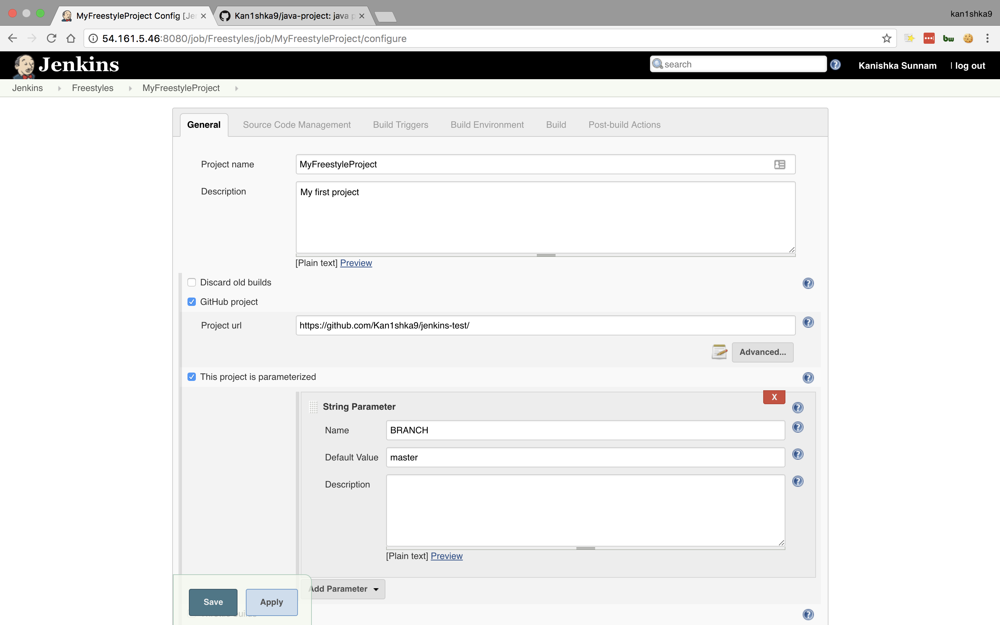

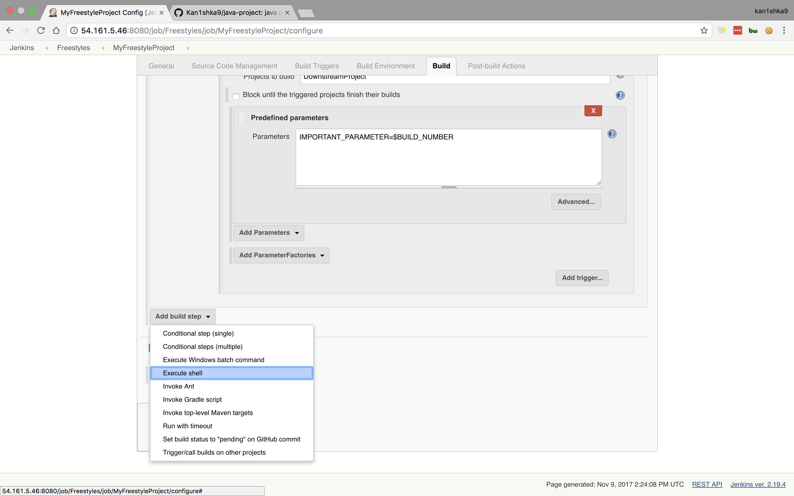

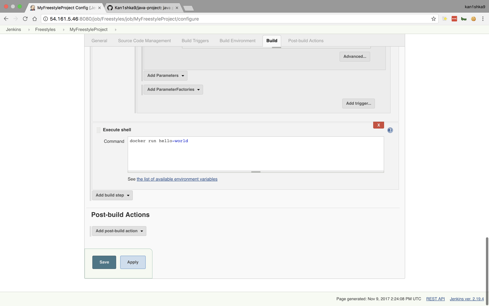

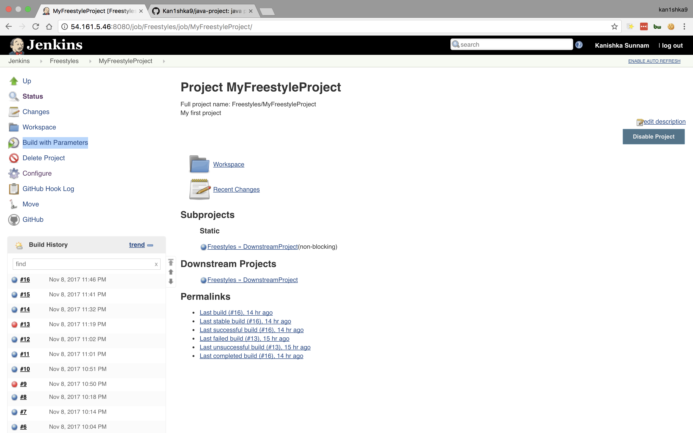

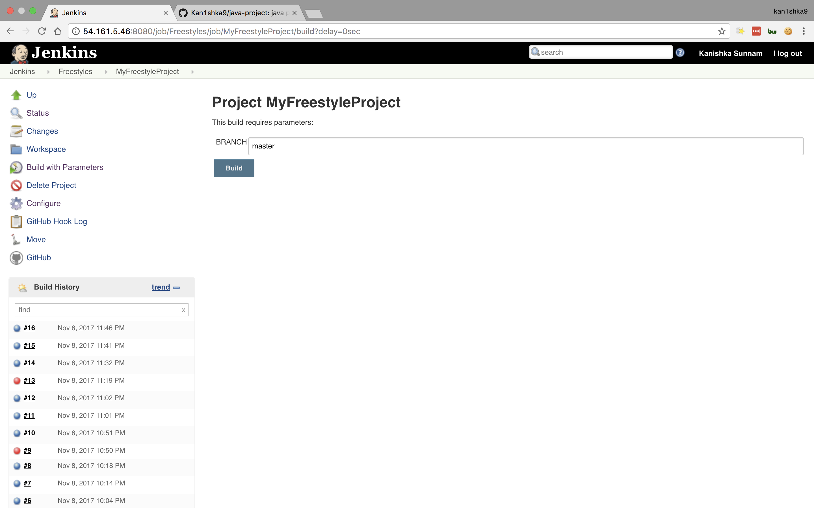

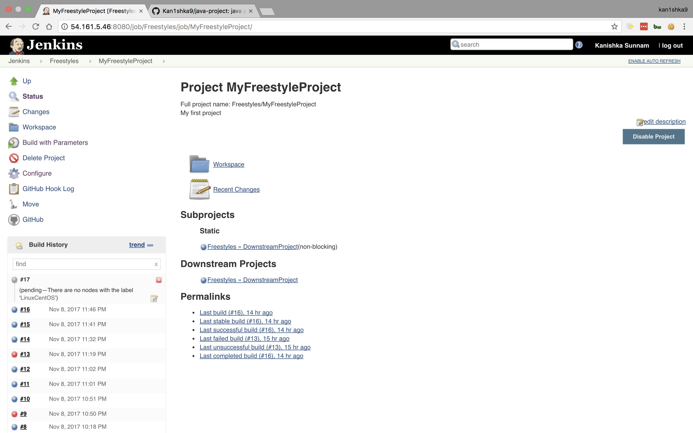

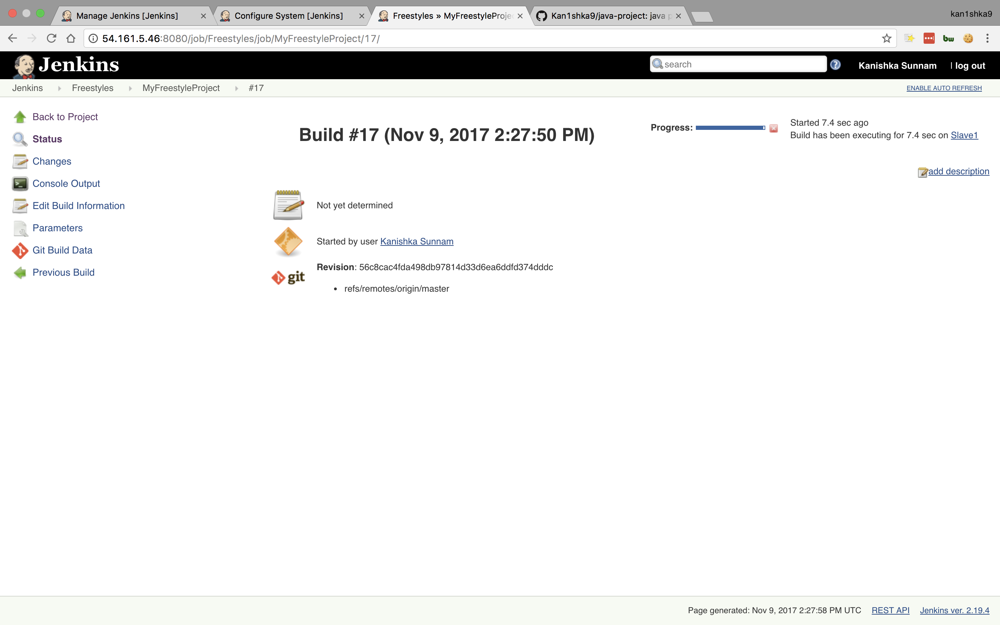

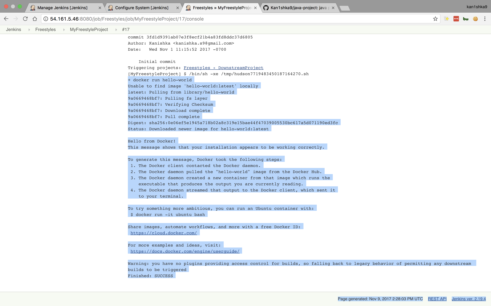

- Install ``docker`` on ``master``

```sh
yum remove docker docker-common container-selinux
yum install yum-utils -y
yum-config-manager --add-repo https://download.docker.com/linux/centos/docker-ce.repo
cat /etc/yum.repos.d/docker-ce.repo
yum clean all
yum install docker-ce -y
gpasswd -a jenkins docker
systemctl start docker
systemctl restart jenkins
```