#### 26. Installing and Configuring Ant

[``Ant binary``](http://ant.apache.org/bindownload.cgi)

```sh
wget http://apache.spinellicreations.com//ant/binaries/apache-ant-1.10.1-bin.tar.gz
tar xvzf apache-ant-1.10.1-bin.tar.gz -C /opt
```

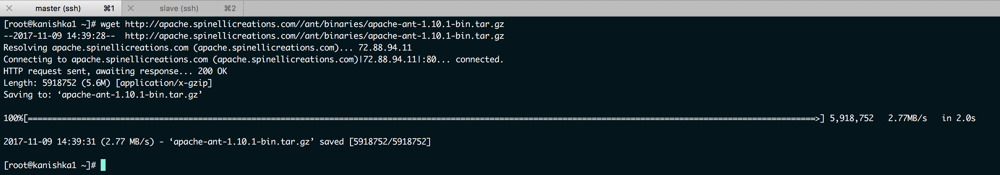

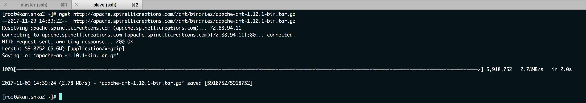

```sh
ln -s /opt/apache-ant-1.10.1/ /opt/ant
sh -c 'echo ANT_HOME=/opt/ant >> /etc/environment'
ln -s /opt/ant/bin/ant /usr/bin/ant
```

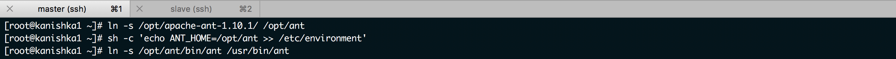

```sh
ln -s /opt/apache-ant-1.10.1/ /opt/ant
ln -s /opt/ant/bin/ant /usr/bin/ant
```

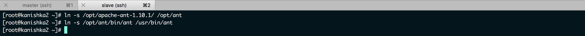

```sh
ant -version
```

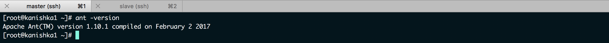

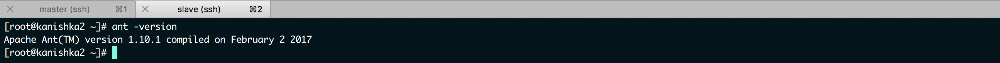

```sh
cd java-project/
touch build.xml
vi build.xml
```

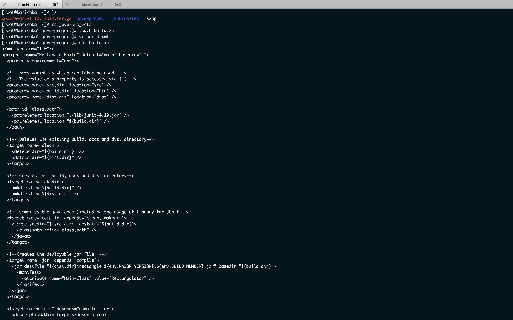

```sh
git status
git add .
git commit -m "added build.xml"
git push origin development
```

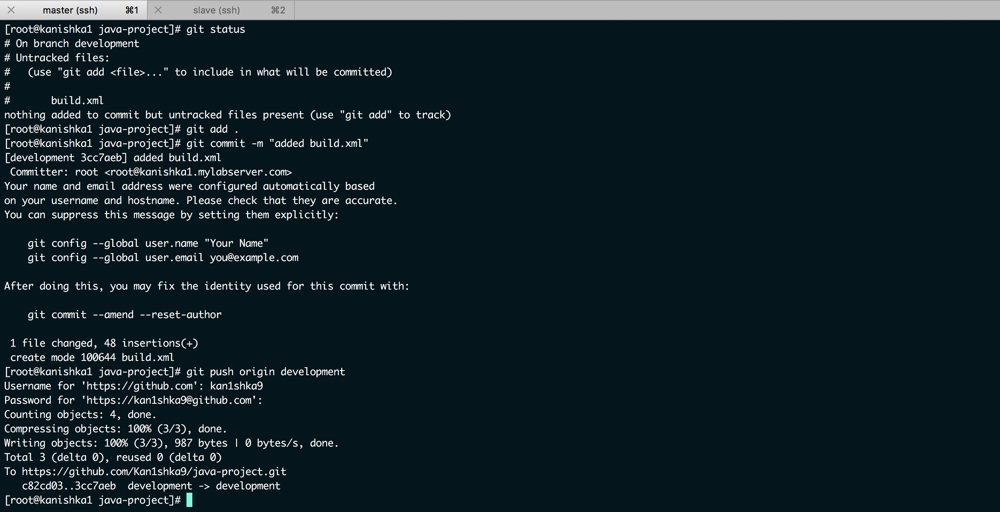

```sh
su jenkins -s /bin/bash
pwd
cd /var/lib/jenkins/
```

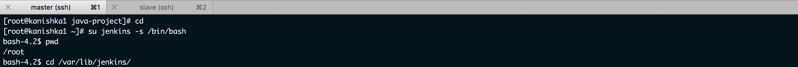

```sh
git clone https://github.com/Kan1shka9/java-project.git
cd java-project/
ls
git checkout development
ls
```

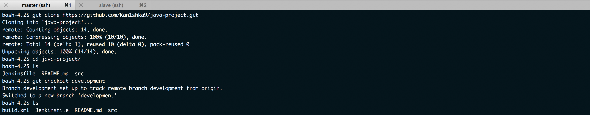

```sh
ant -f build.xml -v
```

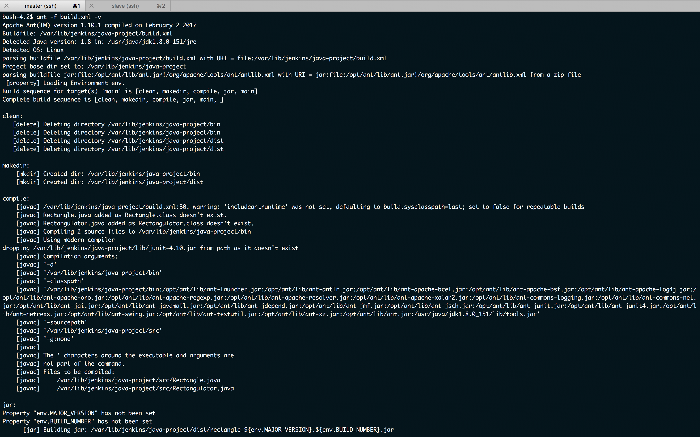

```sh
ls
cd dist/
ls
java -jar rectangle_\$\{env.MAJOR_VERSION\}.\$\{env.BUILD_NUMBER\}.jar 4 5
```

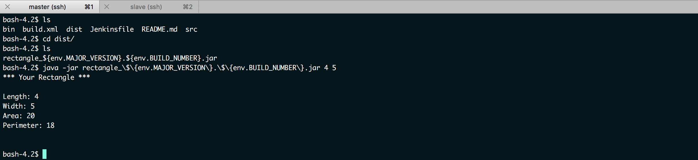

```sh
cd ../../
rm -rf java-project/
```

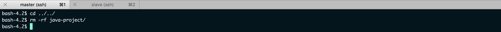