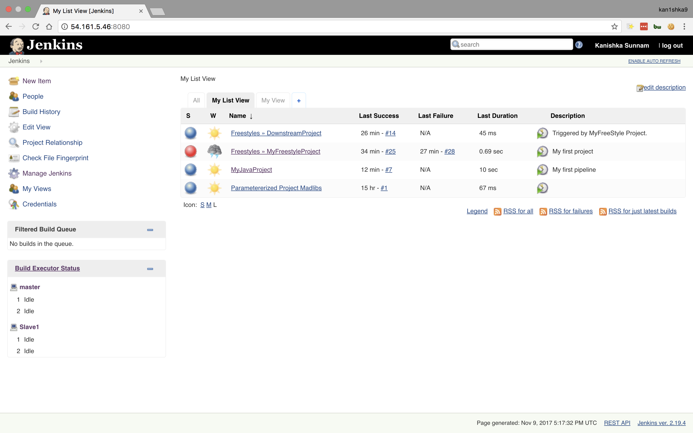
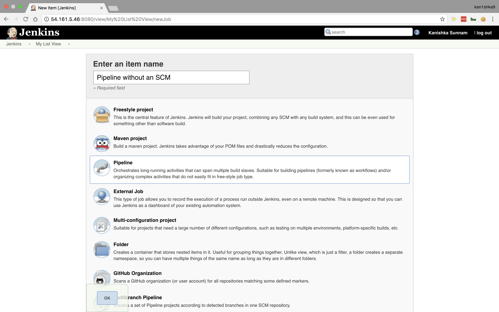
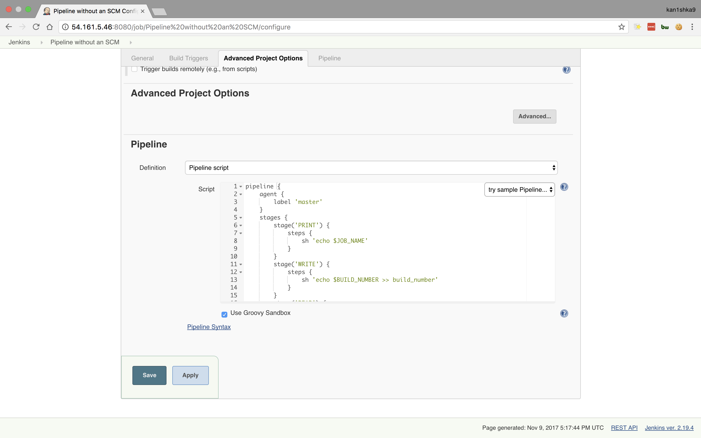
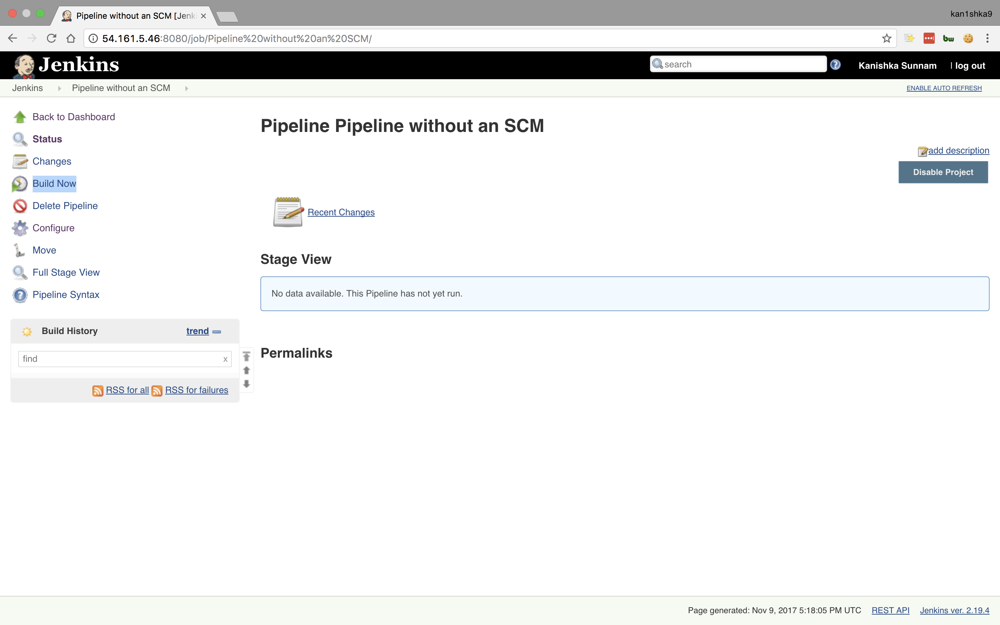
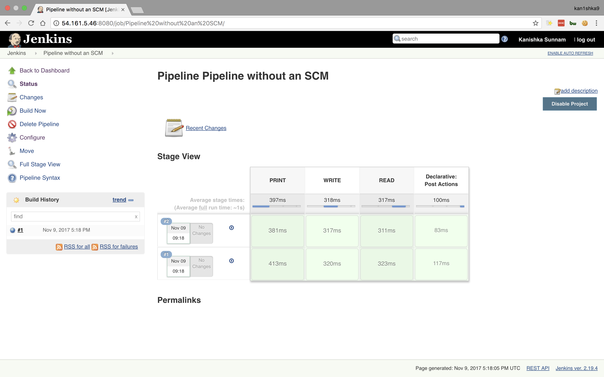
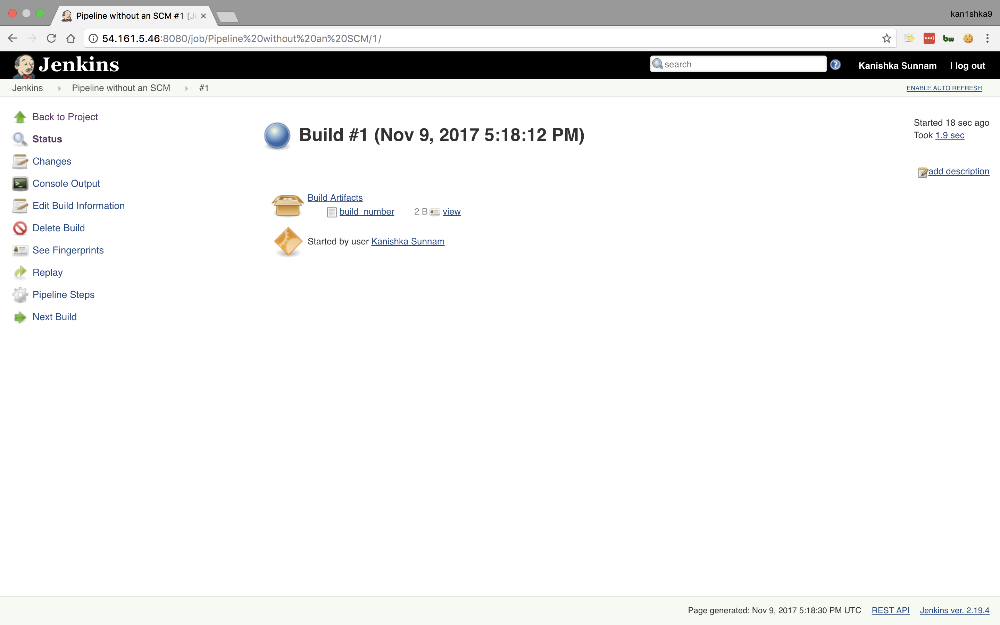
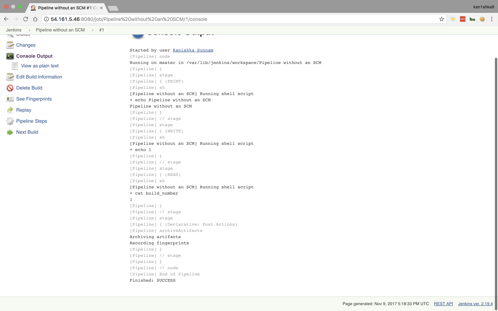
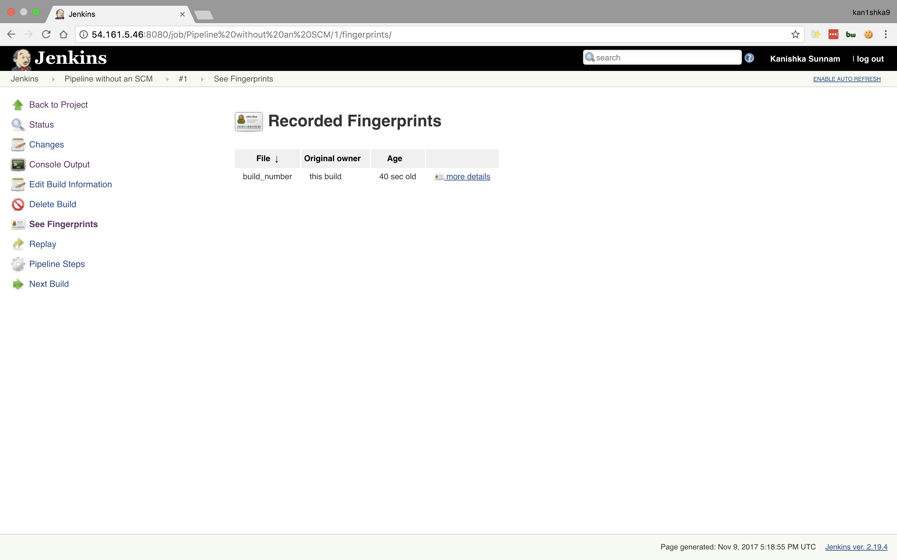
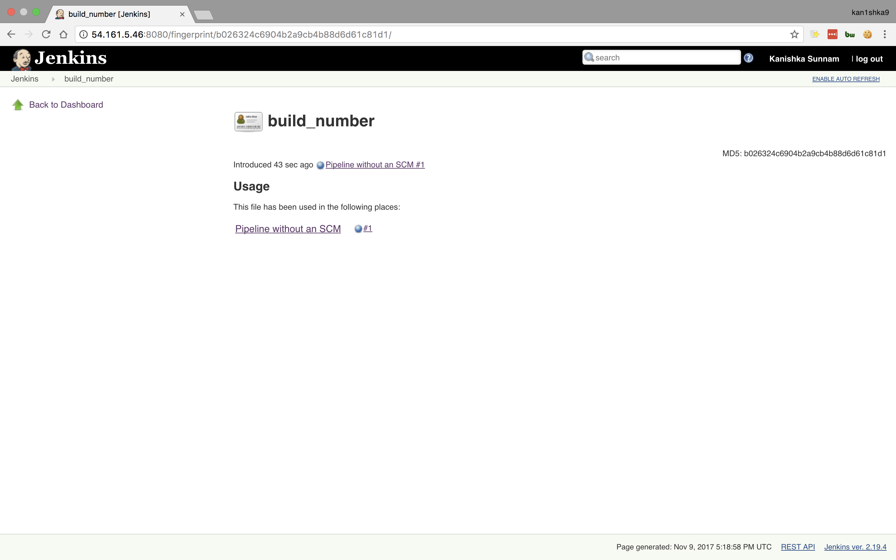

#### 30. Exercise: Build a Simple Pipeline Without SCM

```sh
pipeline {
    agent {
        label 'master'
    }
    stages {
        stage('PRINT') {
            steps {
                sh 'echo $JOB_NAME'
            }
        }
        stage('WRITE') {
            steps {
                sh 'echo $BUILD_NUMBER >> build_number'
            }
        }
        stage('READ') {
            steps {
                sh 'cat build_number'
            }
        }
    }
    post {
        success {
            archiveArtifacts artifacts: 'build_number', fingerprint: true
        }
    }
}
```



















