#### 40. Exercise: Configure Notifications in a Pipeline

```
pipeline {
    agent {
        label 'master'
    }
    stages {
        stage('Greeting') {
            steps {
                sh 'echo "Notification Time!"'
            }
        }
    }
    post {
        success {
            emailext(
                subject: "${env.JOB_NAME} [${env.BUILD_NUMBER}] Ran!",
                body: """
'${env.JOB_NAME} [${env.BUILD_NUMBER}]' Ran!": Check console output at ${env.JOB_NAME} [${env.BUILD_NUMBER}]/a> """, to: "your@email.com" ) } } }
```

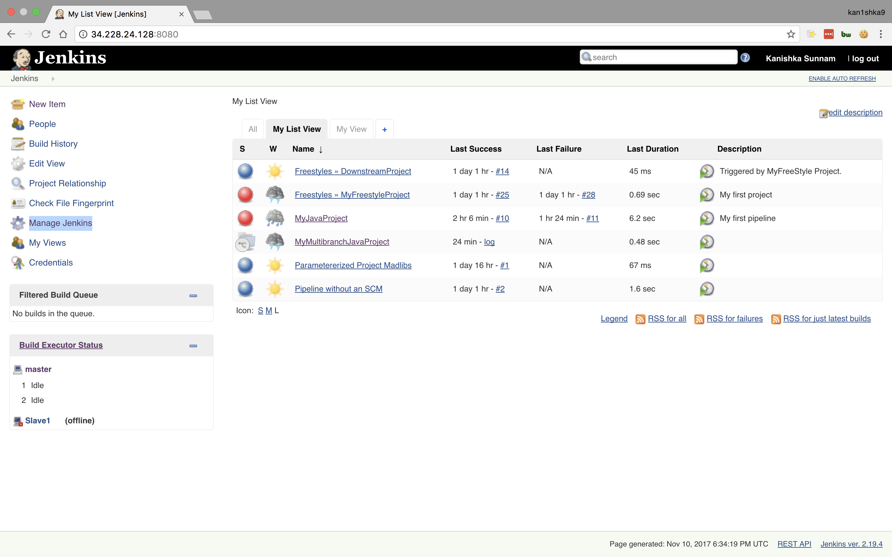

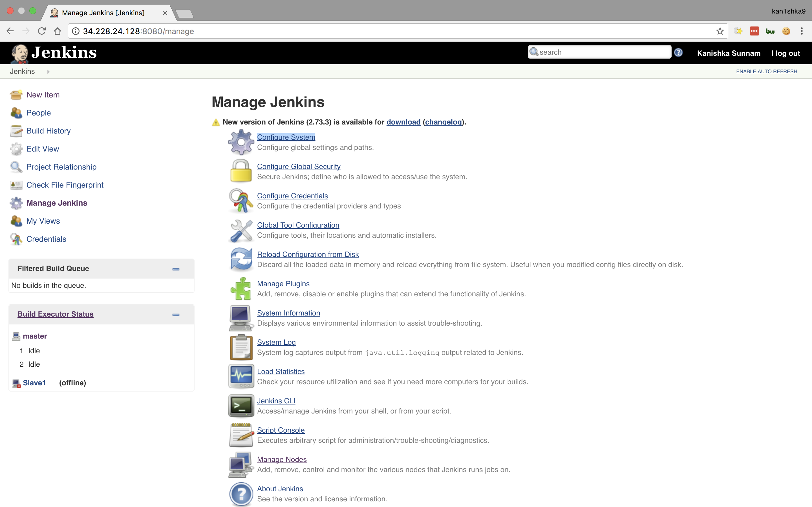

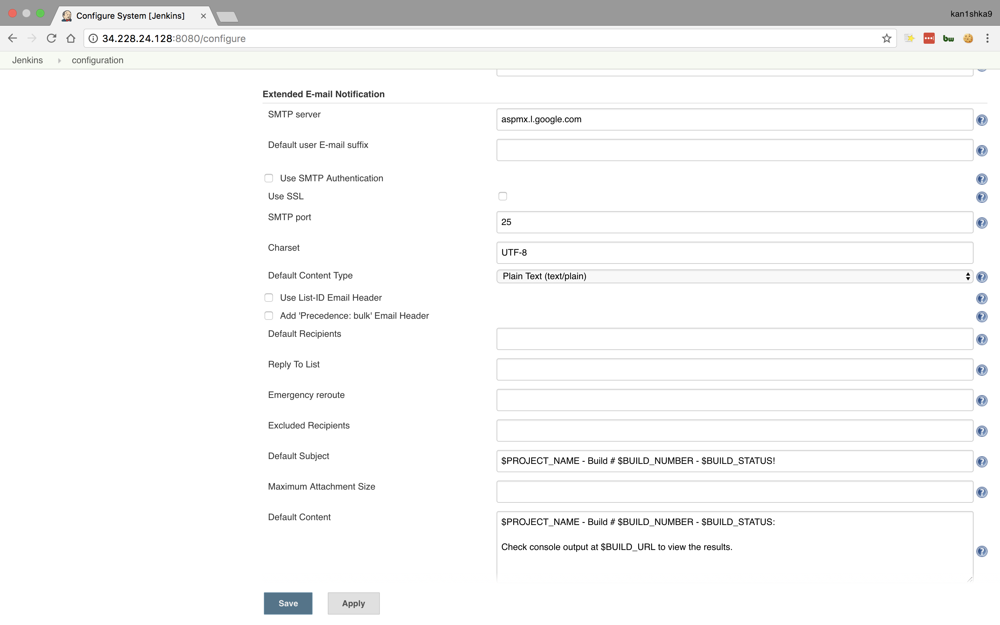

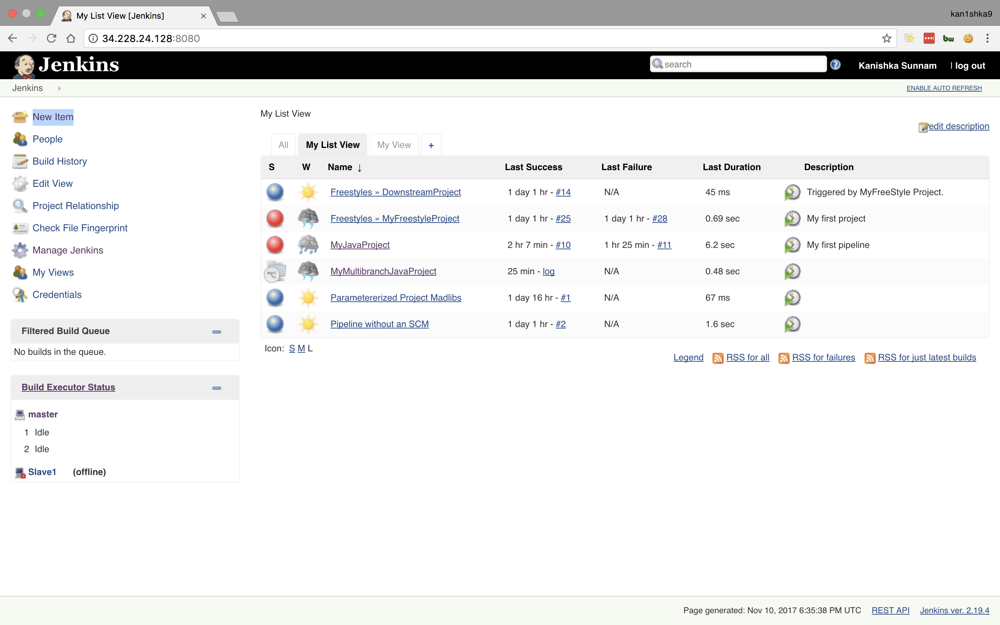

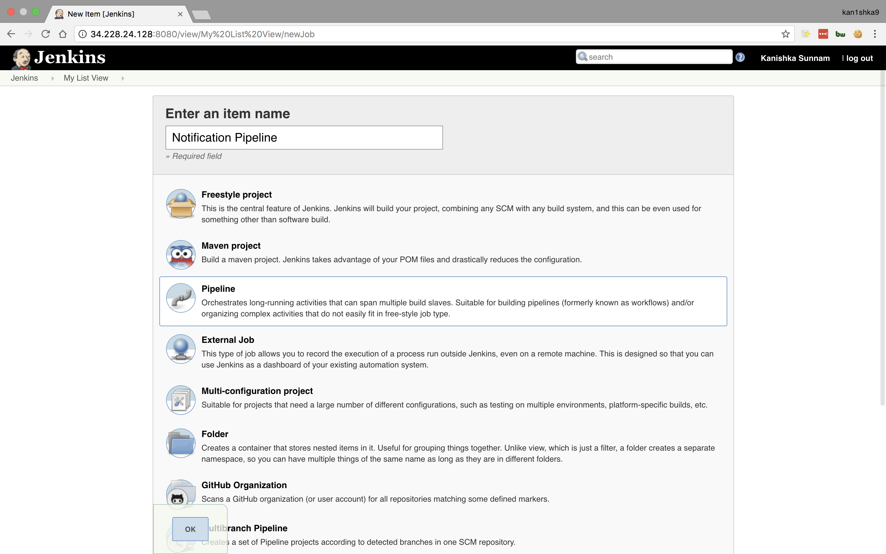

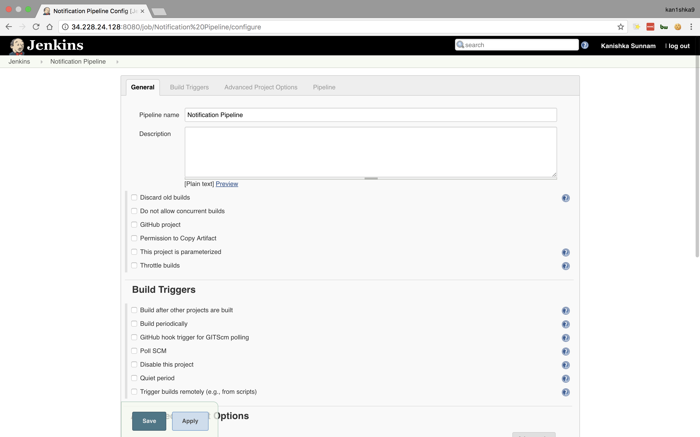

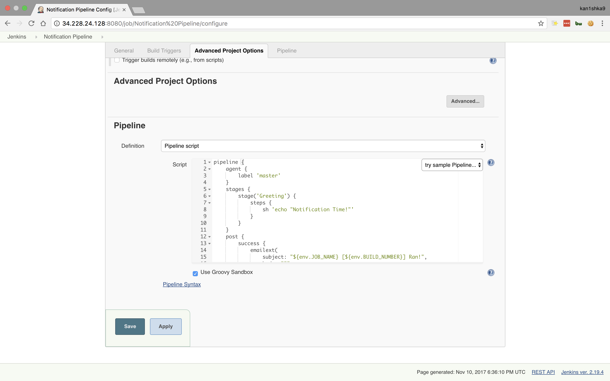

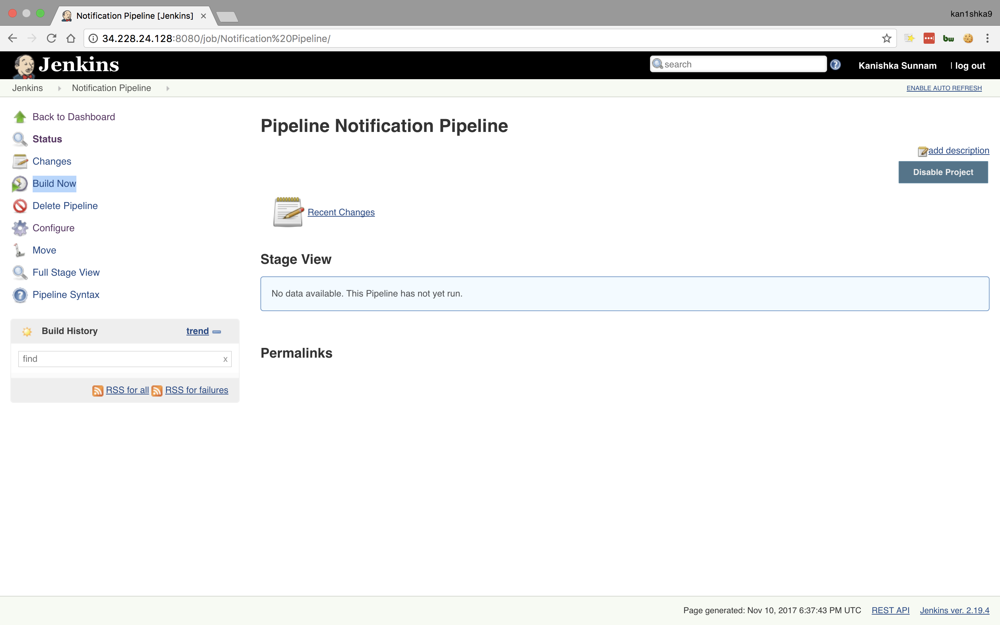

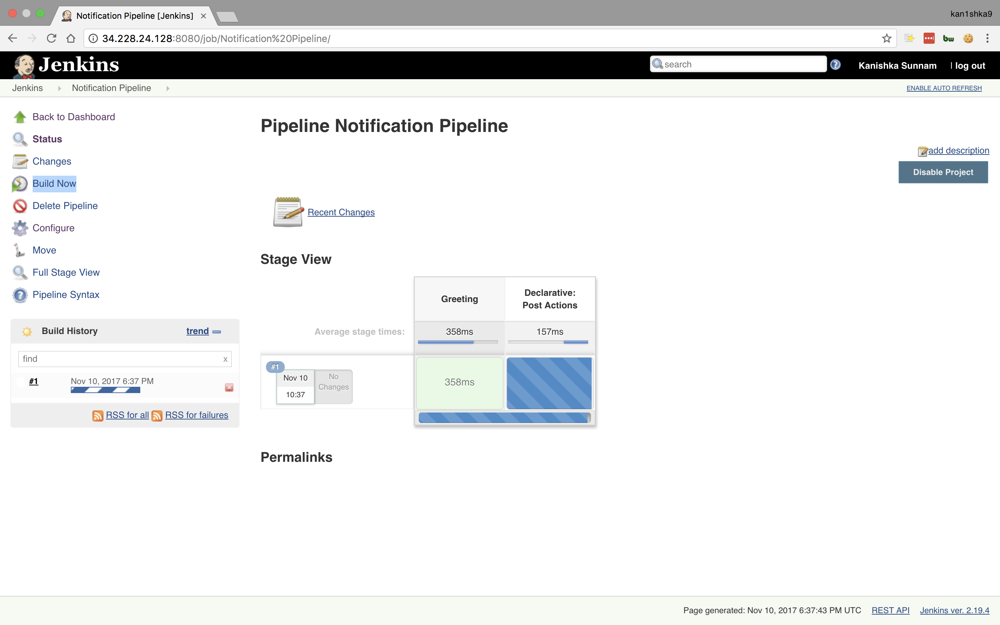

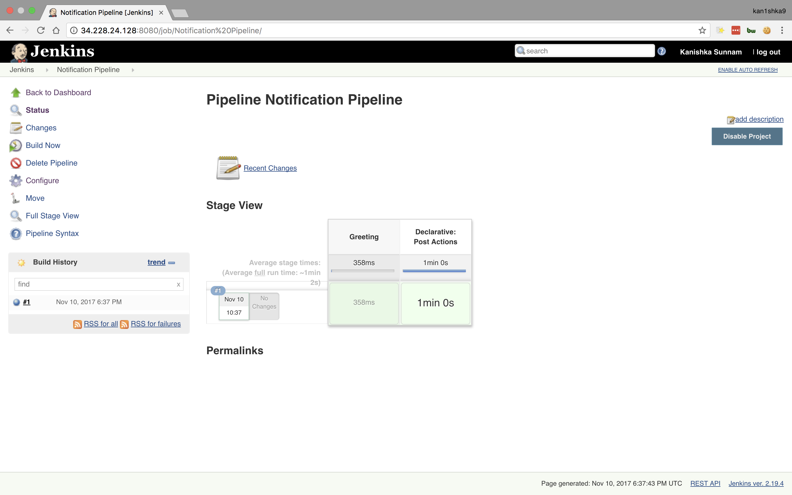

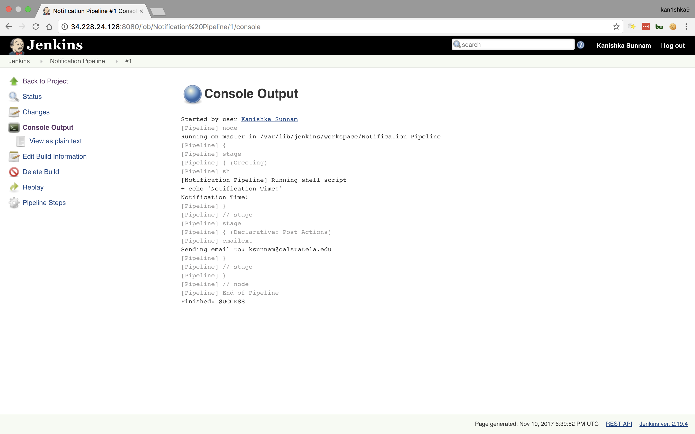