#### 43. The Jenkins CLI

```sh
sudo su -
ssh-keygen
cat .ssh/id_rsa.pub
```

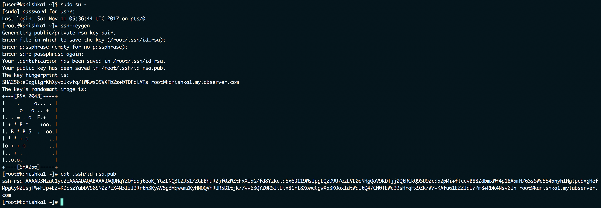

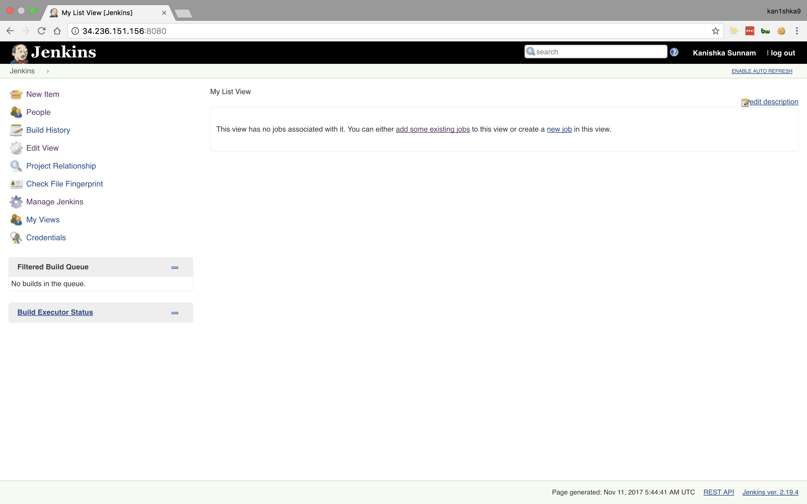

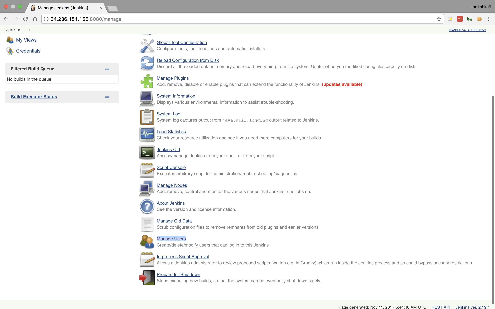

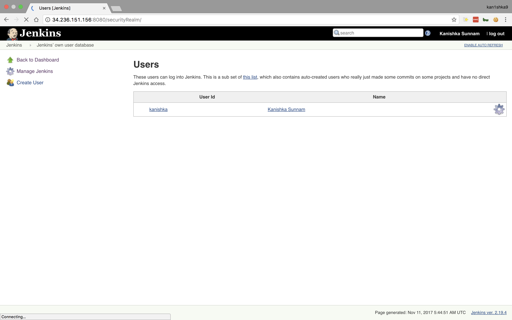

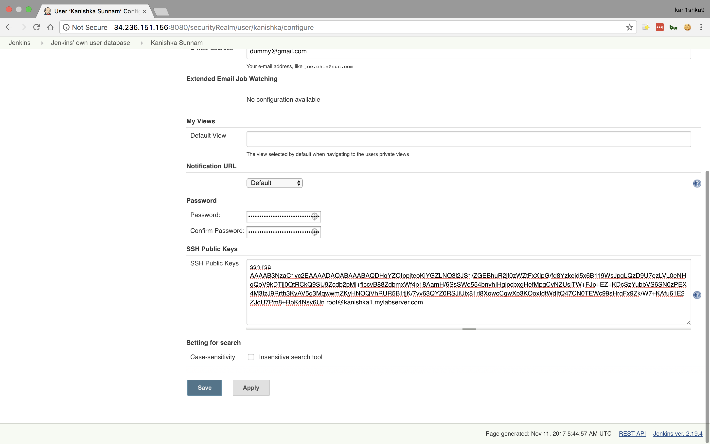

```sh
wget -P /var/lib/jenkins http://localhost:8080/jnlpJars/jenkins-cli.jar
```

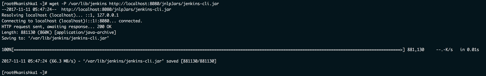

```sh
ls -la /var/lib/jenkins | grep jar
```


```sh
echo "JENKINS_URL='http://localhost:8080'" >> /etc/environment
cat /etc/environment
echo "alias jenkins-cli='java -jar /var/lib/jenkins/jenkins-cli.jar'" >> ~/.bashrc
source ~/.bashrc
jenkins-cli
```

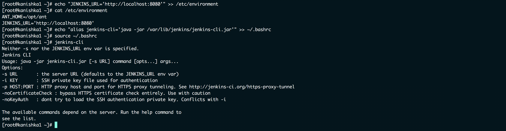

```sh
jenkins-cli -s http://localhost:8080
```

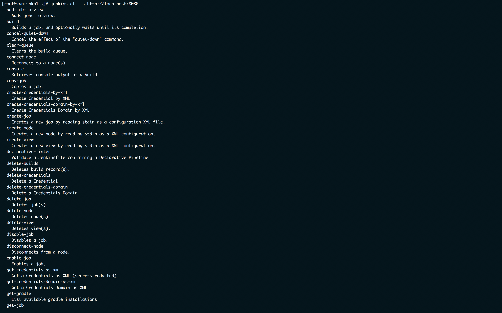

```sh
jenkins-cli -s http://localhost:8080 who-am-i
jenkins-cli -s http://localhost:8080 build "Freestyles/MyFreeStyleProject"
jenkins-cli -s http://localhost:8080 version
jenkins-cli -s http://localhost:8080 shutdown
jenkins-cli -s http://localhost:8080 safe-shutdown
```

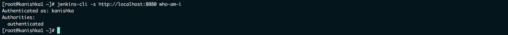

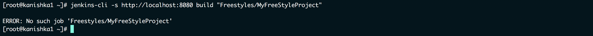

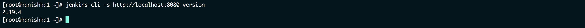


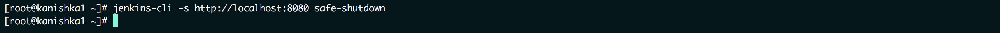

```sh
jenkins-cli -s http://localhost:8080 install-plugin thinBackup -restart
```

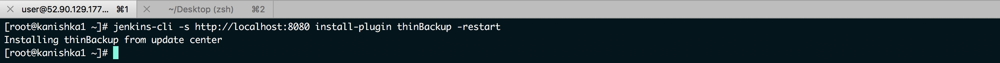

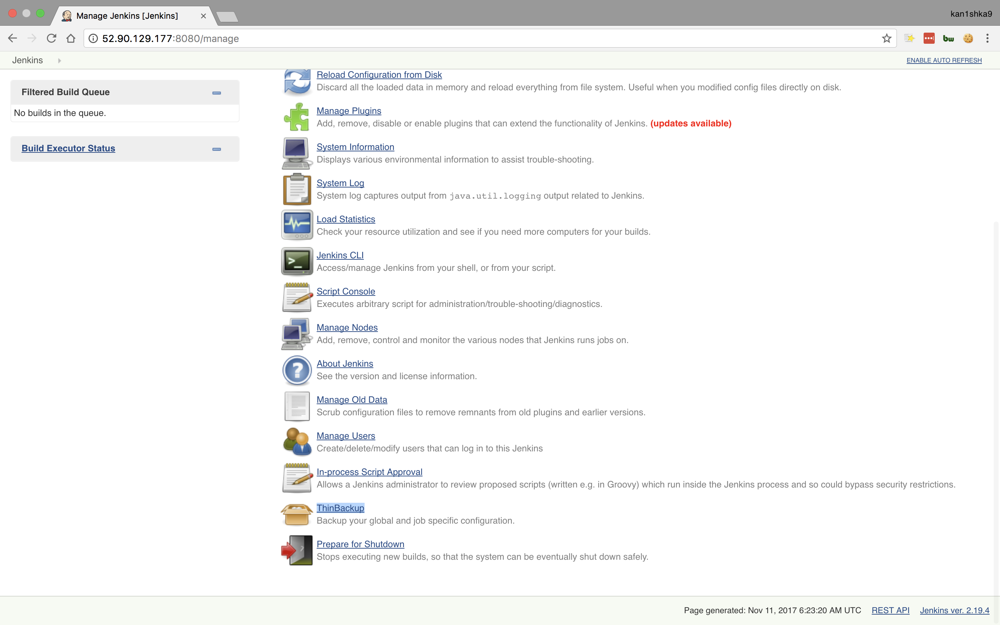

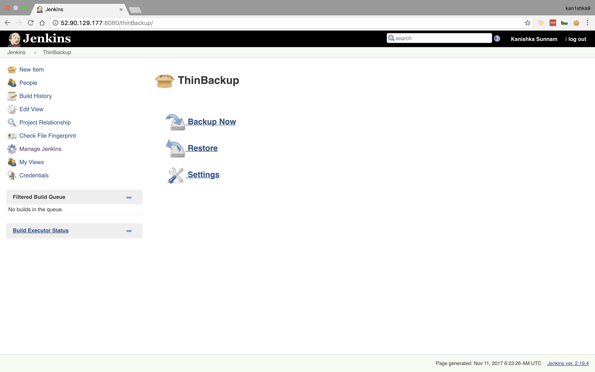

```sh
jenkins-cli -s http://localhost:8080 console "Freestyle/MyFreestyleProject" 51
```