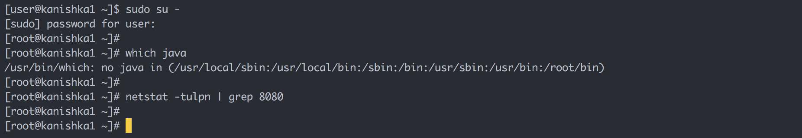
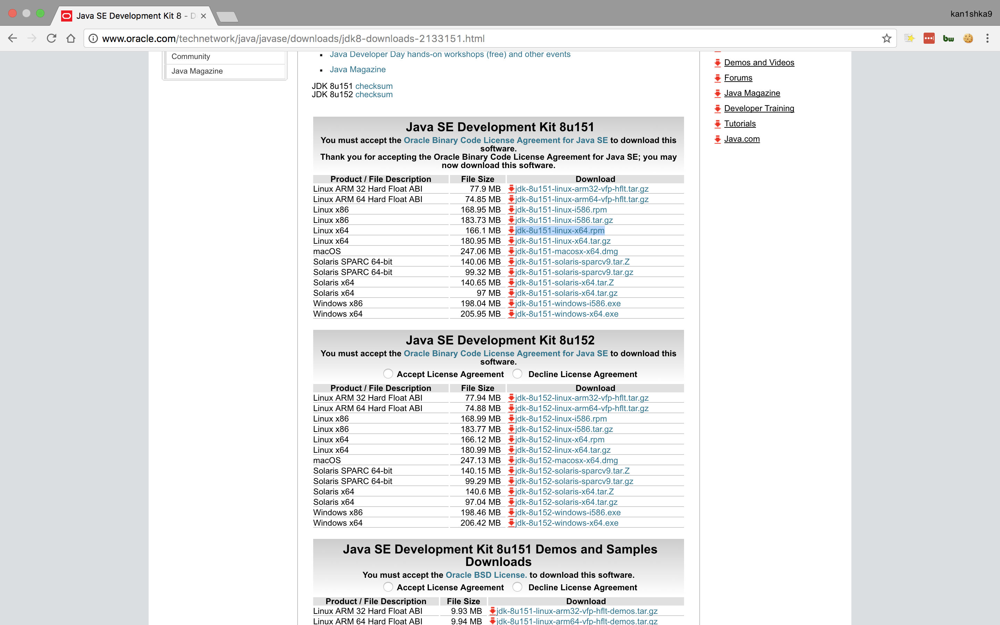
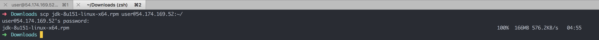
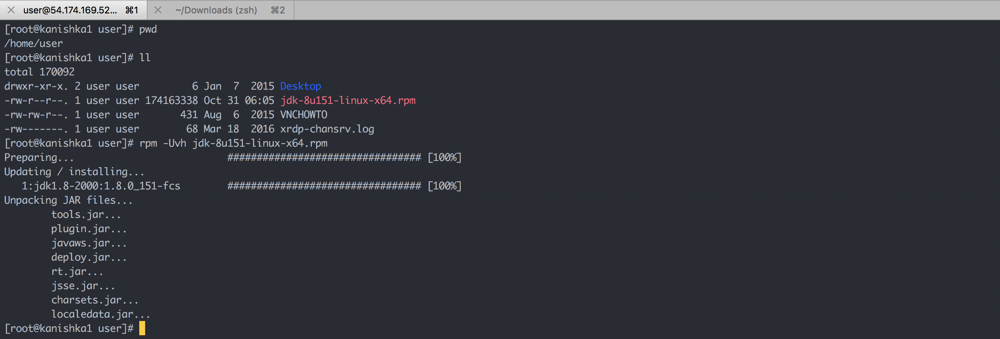
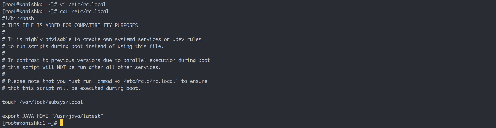

#### 4. Prerequisites

```sh
sudo su -
which java
netstat -tulpn | grep 8080
```





```sh
scp jdk-8u151-linux-x64.rpm user@54.174.169.52:~/
```



```sh
pwd
ll
rpm -Uvh jdk-8u151-linux-x64.rpm
```



```sh
which java
alternatives --install /usr/bin/java java /usr/java/latest/bin/java 200000
alternatives --install /usr/bin/javac javac /usr/java/latest/bin/javac 200000
alternatives --install /usr/bin/jar jar /usr/java/latest/bin/jar 200000
```


```sh
vi /etc/rc.local
```

```
#!/bin/bash
# THIS FILE IS ADDED FOR COMPATIBILITY PURPOSES
#
# It is highly advisable to create own systemd services or udev rules
# to run scripts during boot instead of using this file.
#
# In contrast to previous versions due to parallel execution during boot
# this script will NOT be run after all other services.
#
# Please note that you must run 'chmod +x /etc/rc.d/rc.local' to ensure
# that this script will be executed during boot.

touch /var/lock/subsys/local

export JAVA_HOME="/usr/java/latest"
```

