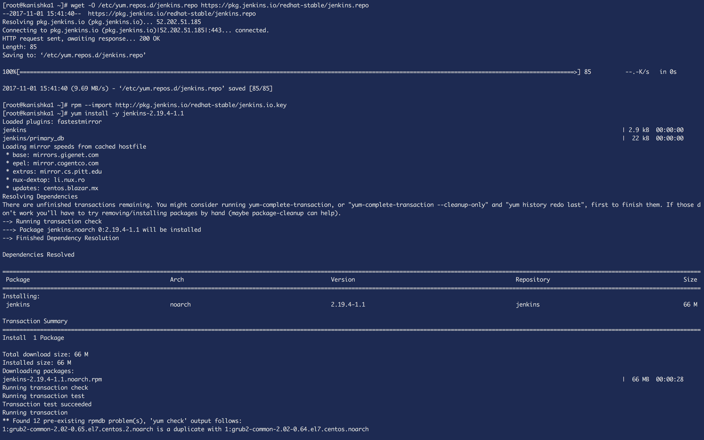
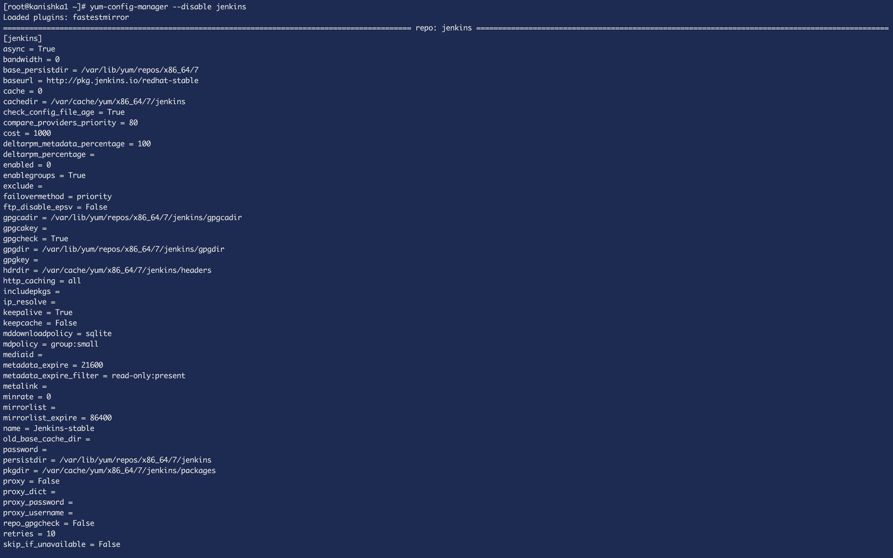
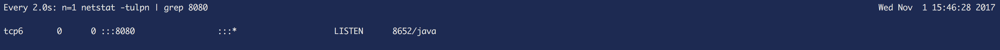
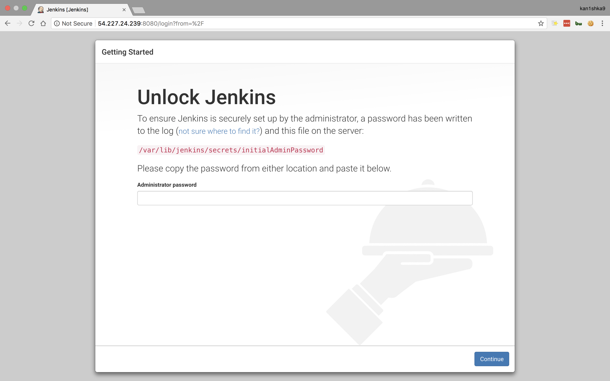
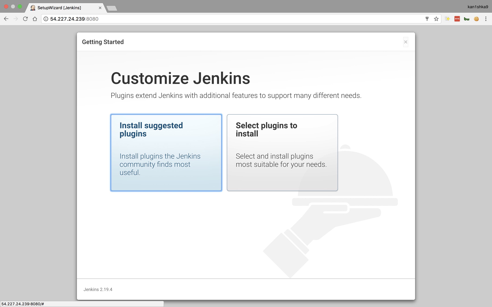
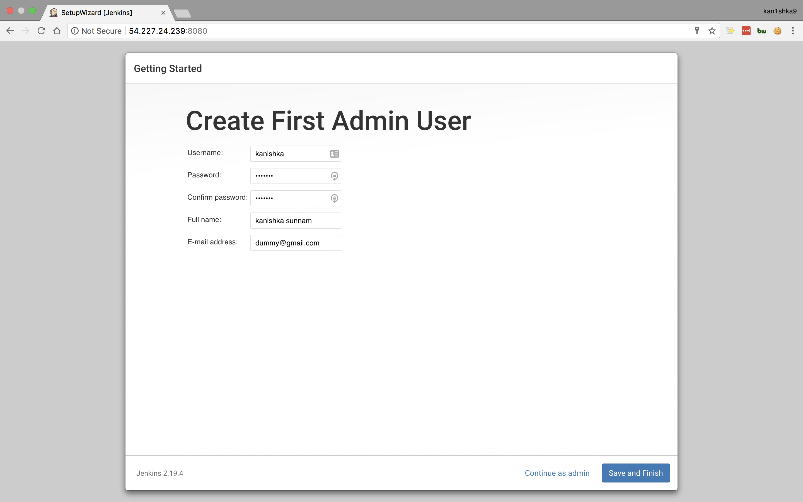
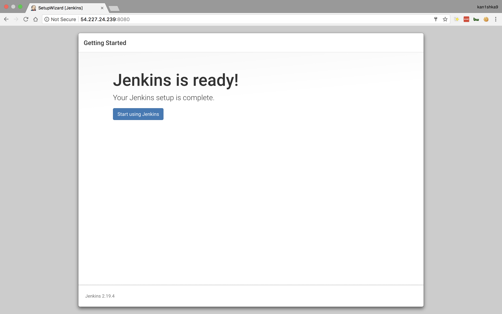
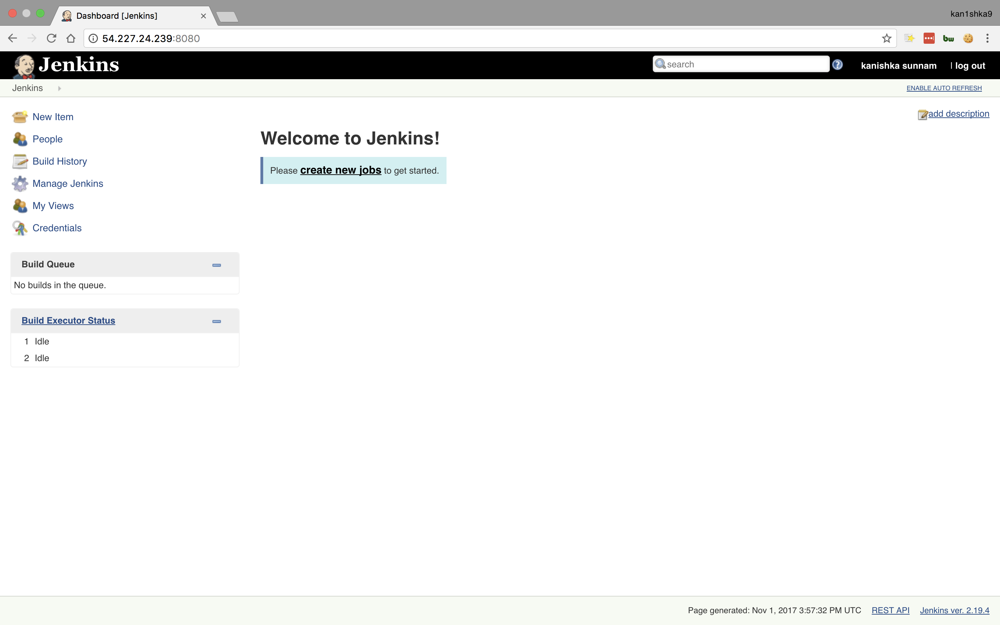

#### 5. Jenkins Install

```sh
wget -O /etc/yum.repos.d/jenkins.repo https://pkg.jenkins.io/redhat-stable/jenkins.repo
rpm --import http://pkg.jenkins.io/redhat-stable/jenkins.io.key
yum install -y jenkins-2.19.4-1.1
```



```sh
yum-config-manager --disable jenkins
```



```sh
systemctl start jenkins
netstat -tulpn | grep 8080
watch n=1 "netstat -tulpn | grep 8080"
```




```sh
systemctl enable jenkins
```




```sh
cat /var/lib/jenkins/secrets/initialAdminPassword
```








