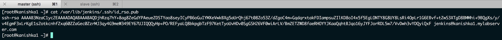
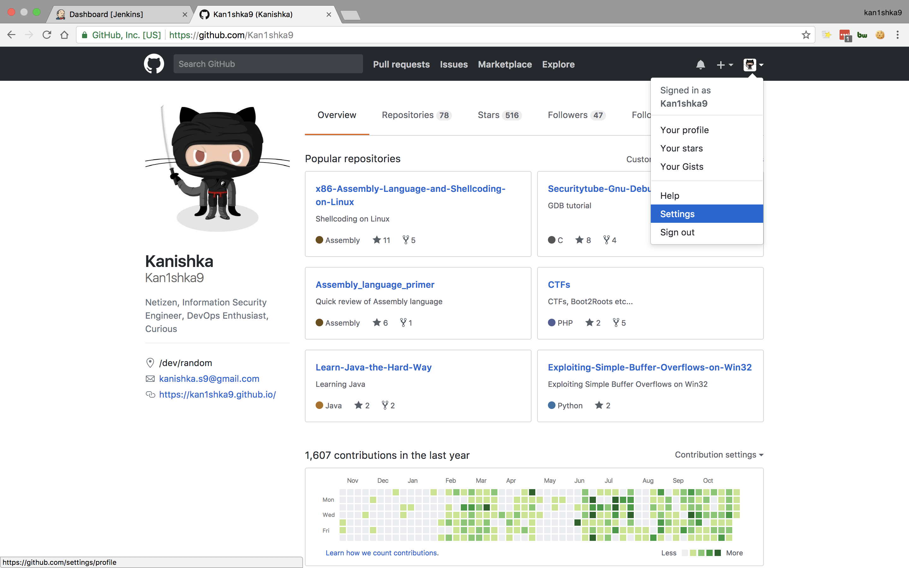
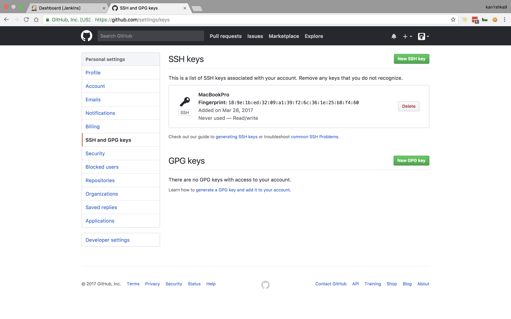
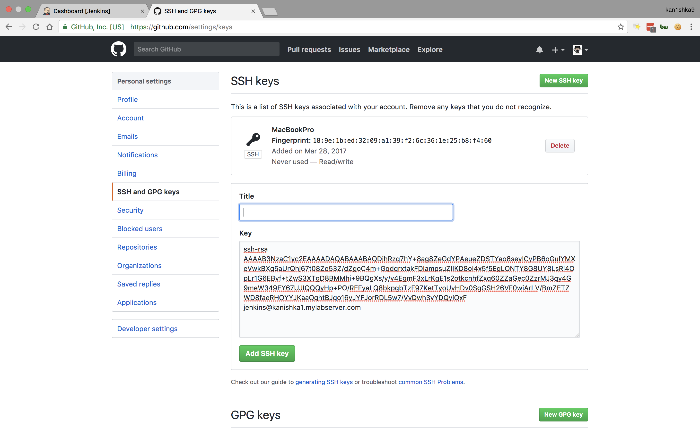
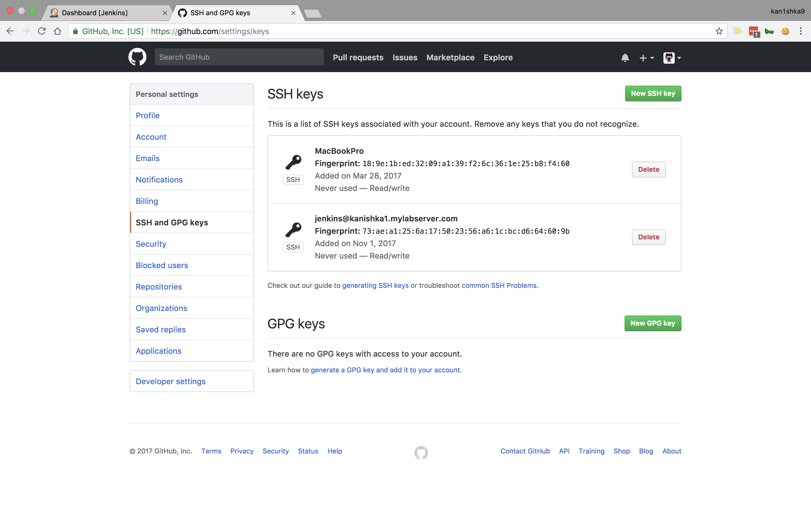
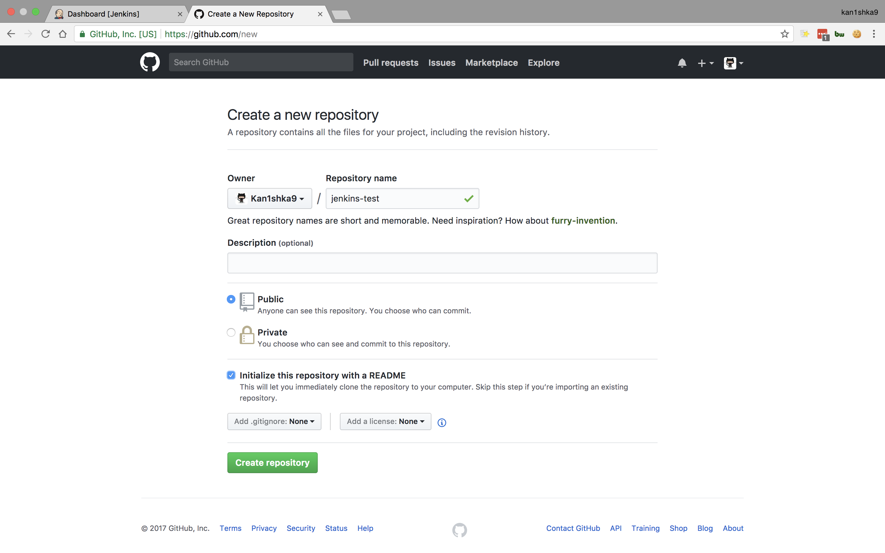
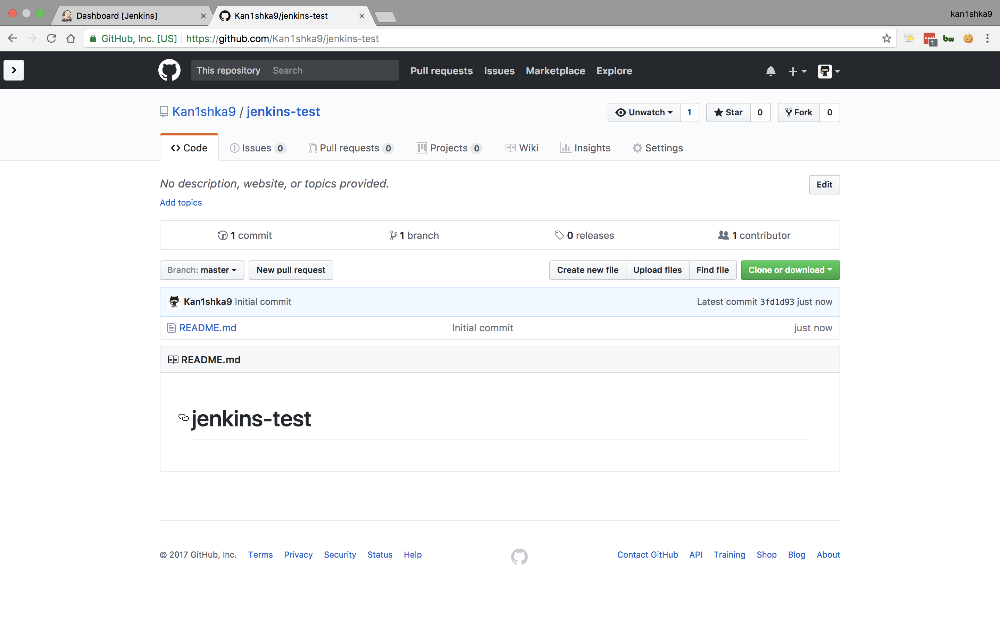
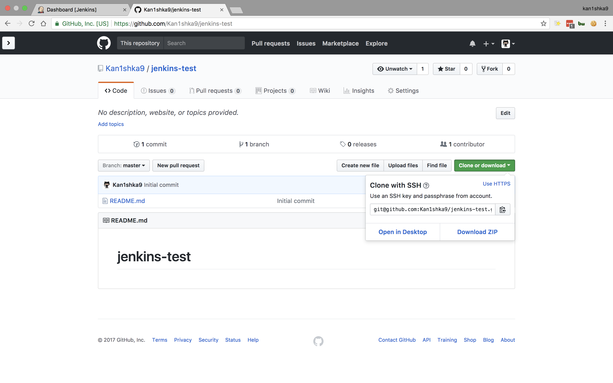
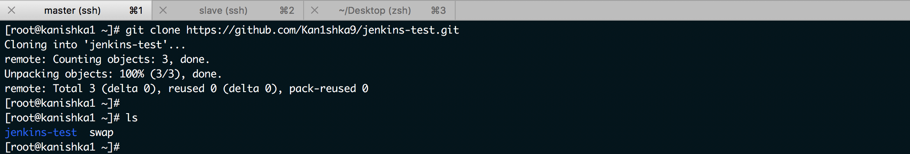
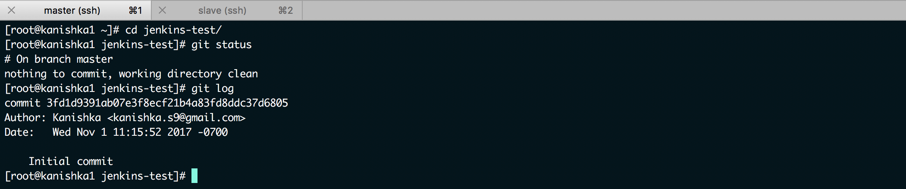

#### 9. Setting Up GitHub

```sh
cat /var/lib/jenkins/.ssh/id_rsa.pub
```

















```sh
git clone https://github.com/Kan1shka9/jenkins-test.git
ls
```



```sh
cd jenkins-test/
git status
git log
```


